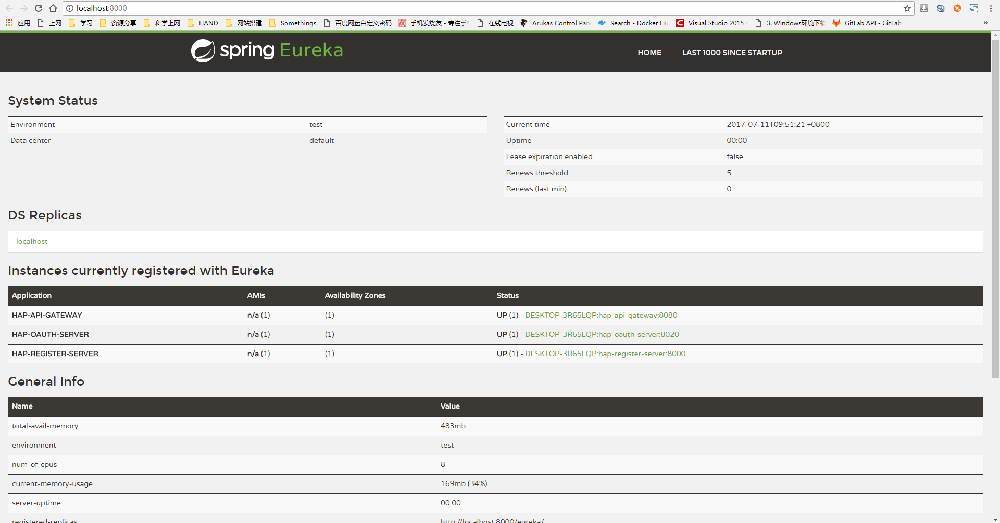
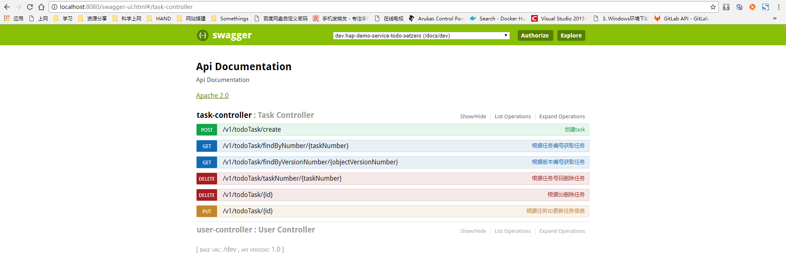
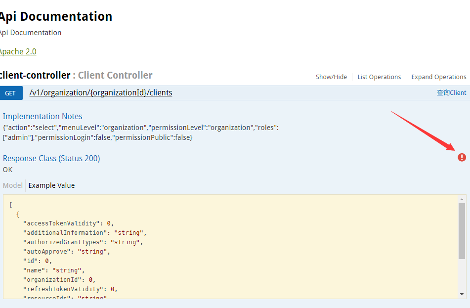
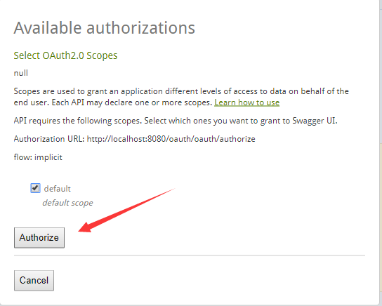
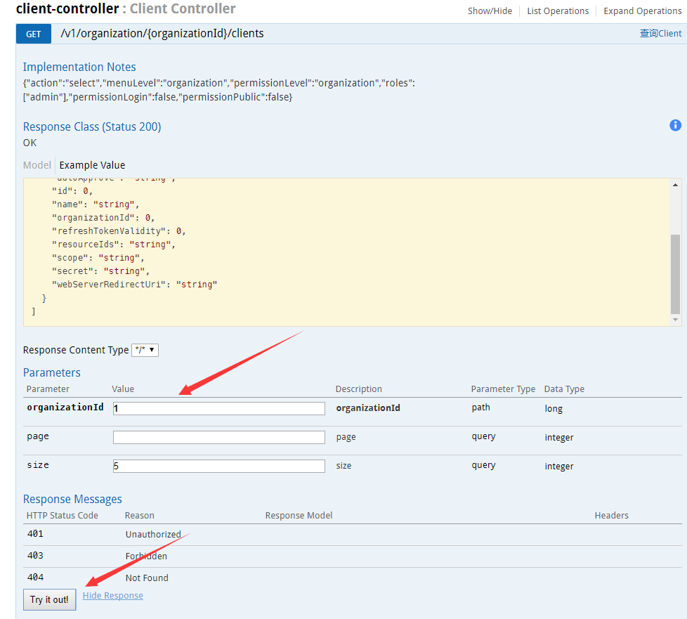
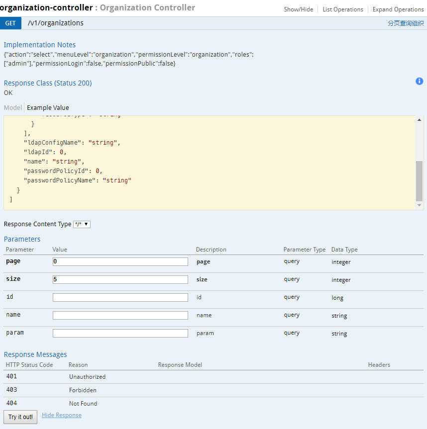
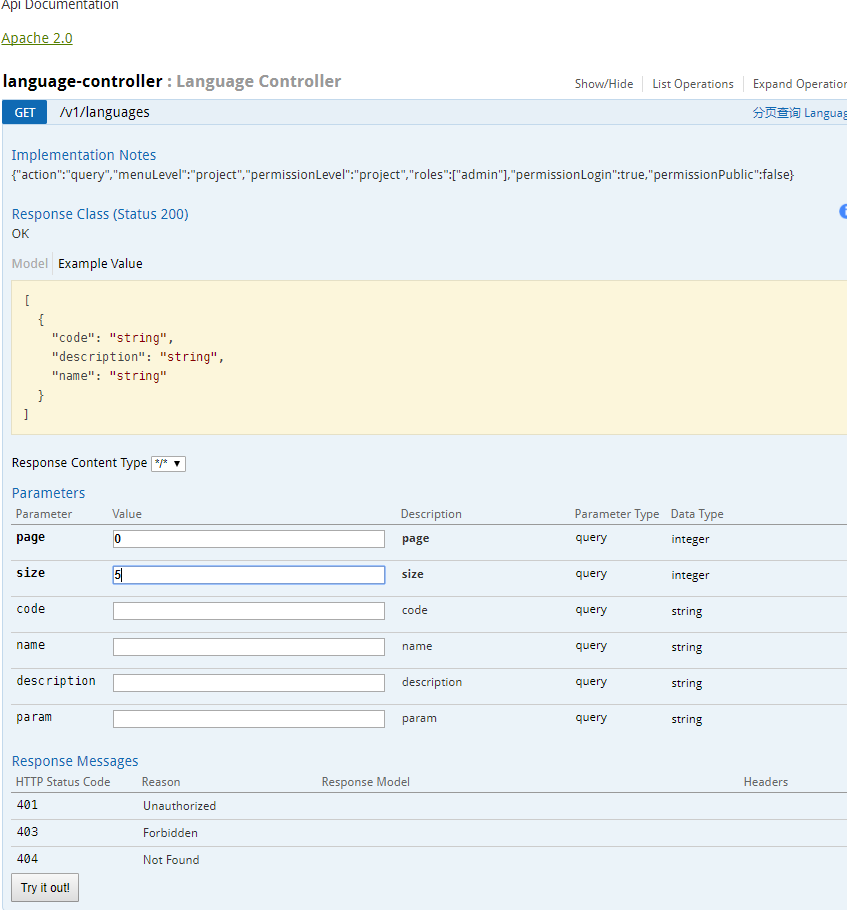
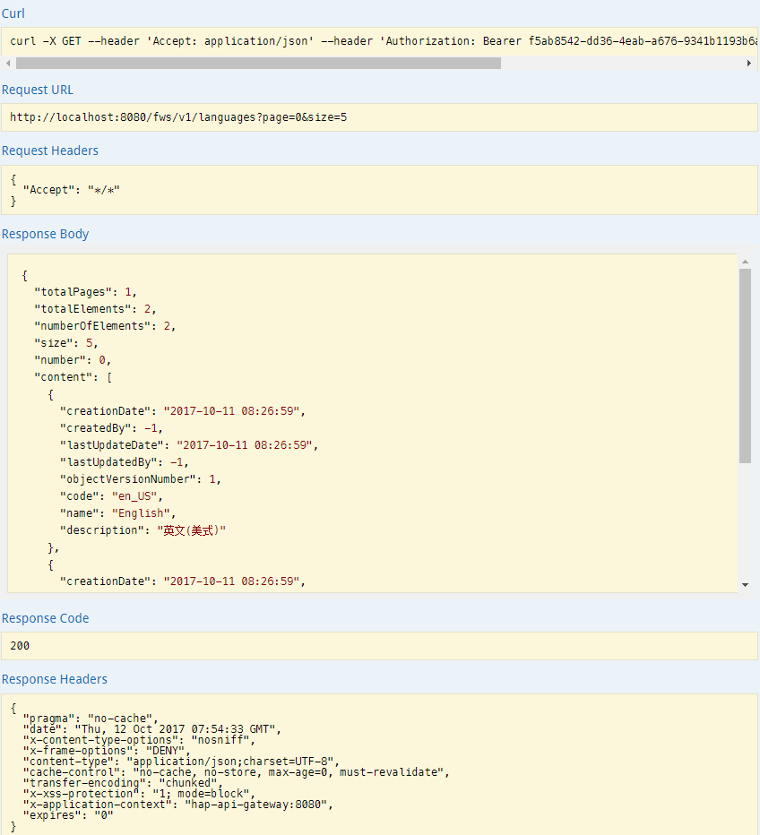

+++
title = "验证测试"
date = "2017-02-01"
draft = false
weight = 3
+++

# 验证测试

## register-server测试

打开浏览器访问 `http://localhost:8000`。正常显示说明注册服务启动成功，可以看到已经注册好的服务。

## api-gateway测试

打开浏览器访问 `http://localhost:8080/swagger-ui.html`。正常显示说明API网关启动成功

上方列表一栏分别与一个服务相关联，通过切换可以看到各个服务的api

## oauth-server测试

在api-gateway测试页面，通过以下步骤获得授权

账号密码为admin/admin

获得授权后，在 `http://localhost:8080/swagger-ui.html` 便可以直接访问api

## user-service测试

以获取某组织下的客户端数据为例

发送参数

获取结果

## user-admin-service测试

## framework-service测试

