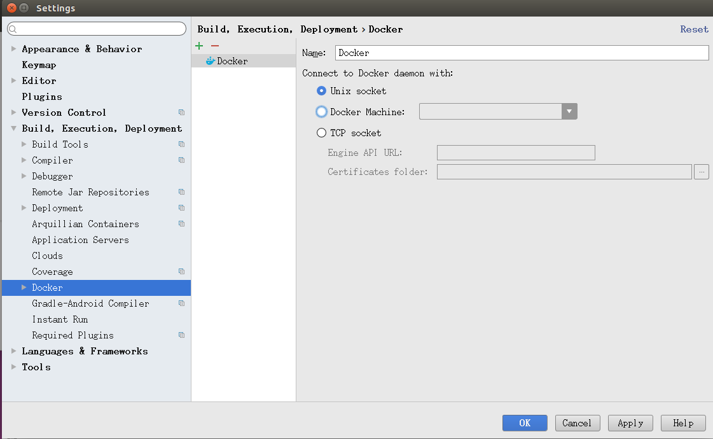
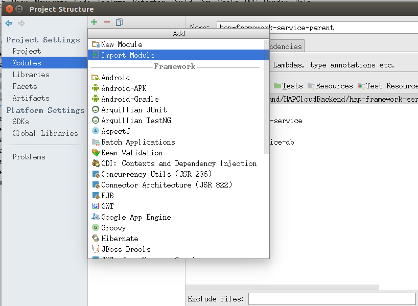
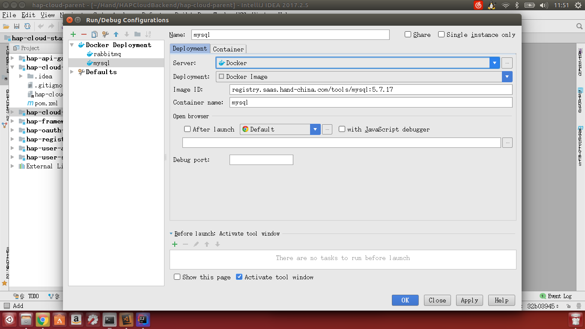
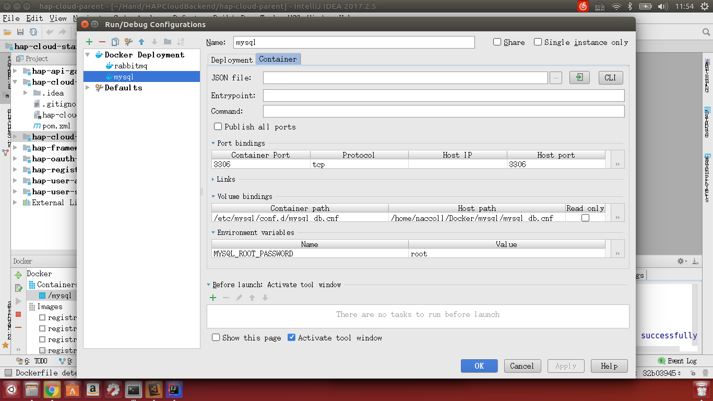
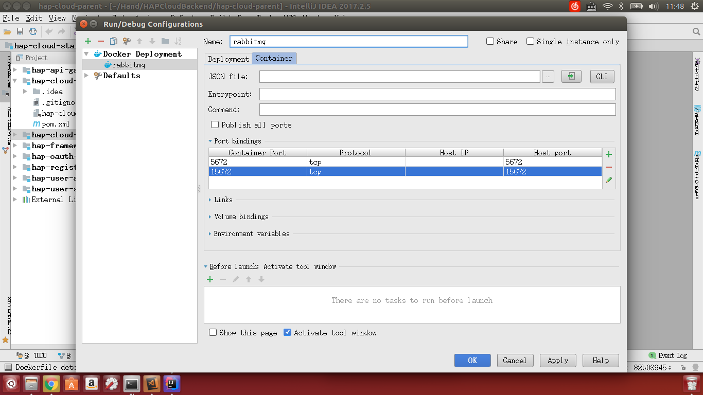
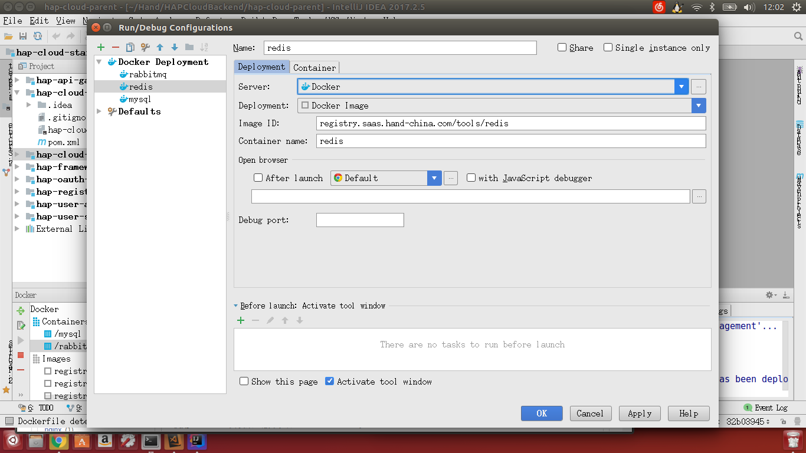

+++
title = "软件安装(Linux)"
date = "2017-02-01"
draft = false
weight = 2
+++

# 软件安装(以Ubuntu为例)

## 开发工具

- Git
- JDK 1.8.0 及以上
- maven 3.3 及以上
- Docker for Ubuntu
- IntelliJ IDEA
- Mysql
- Rabbit MQ
- Redis
- Phpmyadmin (可选)
- Visual Studio Code (可选)

## 更新源

1. 在命令行里输入`sudo apt-get update`，回车。

## Git 安装

1. 在命令行输入`sudo apt-get install git`
1. 安装完成后在命令行执行 `git version`命令 ，输出Git版本信息则安装成功。

### 配置

```bash
curl -o ~/.gitconfig -SL https://raw.githubusercontent.com/carllhw/dotfiles/master/.gitconfig-others
# 请将下面命令按实际情况进行执行
git config --global user.name "Your Name"
git config --global user.email "Your Email"
```

## Java 安装

1. 在命令行中输入`sudo apt-get install openjdk-8-jdk`，回车安装jdk
1. 安装完成后在命令行执行 `java -version`命令 ，输出Java版本信息则安装成功。

## Maven 安装

1. 在命令行输入`sudo apt-get install maven`，回车安装maven
1. 安装完成后打开 git bash 执行 `mvn -v` ，有提示则说明环境安装成功。

## Docker安装

若电脑有旧版的docker，请执行`sudo apt-get remove docker docker-engine docker.io`，将其删除

依次执行以下指令，安装docker

```bash
$ sudo apt-get update

$ sudo apt-get install \
    linux-image-extra-$(uname -r) \
    linux-image-extra-virtual

$ sudo apt-get update

$ sudo apt-get install \
    apt-transport-https \
    ca-certificates \
    curl \
    software-properties-common

$ curl -fsSL https://download.docker.com/linux/ubuntu/gpg | sudo apt-key add -

$ sudo add-apt-repository \
   "deb [arch=amd64] https://download.docker.com/linux/ubuntu \
   $(lsb_release -cs) \
   stable"

$ sudo apt-get update

$ sudo apt-get install docker-ce

$ sudo gpasswd -a ${USER} docker # 将当前用户加入docker组，避免每次使用docker指令都得使用sudo

$ docker version # 验证是否安装成功

$ sudo curl -L https://github.com/docker/compose/releases/download/1.16.1/docker-compose-`uname -s`-`uname -m` -o /usr/local/bin/docker-compose # 安装docker-compose

$ sudo chmod +x /usr/local/bin/docker-compose

$ docker-compose --version # 验证安装时否成功
```

**Note. 注意机器必须开启虚拟化支持，部分机型默认禁用，需进入bios进行设置，因各机型设置不相一致，在此不做详细说明**

## IntelliJ IDEA 安装配置

1. 在 `IDEA官网` 下载与本机系统相符的安装包。
1. 解压
1. 进入解压出的文件夹里的bin文件夹，使用命令行运行`./idea.sh`

### Idea配置

1. 安装Docker插件。在File-Settings-Plugins中，搜索Docker integration，点击Install安装，并重启软件加载插件。

    

    **因网络原因，可能导致下载失败，若一直不能下载成功，可跳过Idea关于Docker的相关配置步骤，在下方关于Docker容器启动方式选择第二种——Docker-Compose**

1. IDEA中配置Docker，在File-Settings-Build,Execution,Deployment-Clouds中，点击加号新建，会自动读取docker信息，直接保存即可。

    

## 克隆代码

### 克隆代码到本地

1. 使用 `git clone https://rdc.hand-china.com/gitlab/HAPCloud/HAPCloudBackend.git` 将项目 clone 到本地
1. 进入项目中执行`git submodule update --init --recursive`命令将所有后端子模块初始化。

### 导入项目到IDEA开发工具中

打开已安装好的IDEA开发工具，将clone到本地的项目导入到开发工具IDEA中，会自动下载依赖包。

因为各模块分离，故而可通过idea的File > Project Structure添加module




## 服务环境准备

### 准备

在~/Docker/mysql下新建mysql_data文件夹，同时新建一个mysql_db.cnf文件，内容如下

```
[mysqld]
lower_case_table_names=1
character_set_server=utf8
max_connections=500
```

也可在其他位置创建，但需注意与下方使用该配置文件时的路径相对应。

### 安装

首先，打开cmd或者powershell分别执行以下指令，对所需的Docker镜像进行拉取。

```bash
docker pull registry.saas.hand-china.com/tools/mysql:5.7.17
docker pull registry.saas.hand-china.com/tools/rabbitmq:3.6.1-management
docker pull registry.saas.hand-china.com/tools/redis
docker pull registry.saas.hand-china.com/tools/phpmyadmin
```

### 启动Docker容器

以下两种方式任选一种进行

#### 1. Idea启动Docker

##### MySQL配置

- Name: mysql
- Docker Deployment

  ```
  Server: Docker
  Deployment: Docker Image
  Image ID: registry.saas.hand-china.com/tools/mysql:5.7.17
  Container name: mysql
  ```

- Docker Container

  - Port bindings

    Container Port | Protocol | Host IP | Host Port
    ---|---|---|---
    3306 | tcp |  | 3306

  - Volume bindings

    Container Path | Host path | Read only
    ---|---|---
    /var/lib/mysql | /home/用户名/Docker/mysql/mysql_data |
    /etc/mysql/conf.d/mysql_db.cnf | /home/用户名/Docker/mysql/mysql_db.cnf |

    用户名请以当前用户名替代。

    Host path 可以根据自己需求自己选择映射位置，第一项为mysql的数据存放文件夹，第二项为mysql的配置文件，请确保确映射类型对应且必须存在。

  - Environment variables

    Name | value
    ---|---
    MYSQL_ROOT_PASSWORD | root

    

    

##### Rabbit MQ配置

- Name: rabbitmq
- Docker Deployment

  ```
  Server: Docker
  Deployment: Docker Image
  Image ID: registry.saas.hand-china.com/tools/rabbitmq:3.6.1-management
  Container name: rabbitmq
  ```

- Docker Container

  - Port bindings

    Container Port | Protocol | Host IP | Host Port
    ---|---|---|---
    15672 | tcp |  | 15672
    5672 | tcp |  | 5672

    

    

##### Redis配置

- Name: redis
- Docker Deployment

  ```
  Server: Docker
  Deployment: Docker Image
  Image ID: registry.saas.hand-china.com/tools/redis
  Container name: redis
  ```

- Docker Container

  - Port bindings

    Container Port | Protocol | Host IP | Host Port
    ---|---|---|---
    6379 | tcp |  | 6379

    

    

###### phpadmin

- Name: phpadmin
- Docker Deployment

  ```
  Server: Docker
  Deployment: Docker Image
  Image ID: registry.saas.hand-china.com/tools/phpmyadmin
  Container name: phpadmin
  ```

- Docker Container

  - Port bindings

    Container Port | Protocol | Host IP | Host Port
    ---|---|---|---
    80 | tcp |  | 80

  - Environment variables

    Name | value
    ---|---
    PMA_ARBITRARY | 1

    

    

#### 2. 通过docker-compose来启动docker

在~/Docker目录下新建docker-compose.yml文件内容如下:

```yaml
version: "3"
services:
  mysql:
    container_name: mysql  # 容器名
    image: registry.saas.hand-china.com/tools/mysql:5.7.17 # 容器所使用的镜像，镜像形式为[username 或 url]/repository:tag，该镜像为公司搭设的docker仓库内的镜像
    ports:
      - "3306:3306" # [本机端口:容器内端口] 将本机端口与docker容器内部应用的端口映射，以提供外部对容器内应用的访问能力
    environment:
      MYSQL_ROOT_PASSWORD: root # 设置mysql密码
    volumes:
      - ./mysql/mysql_data:/var/lib/mysql # 将mysql中的数据文件映射到本机文件夹，":"前的为本机地址，后的为容器内地址
      - ./mysql/mysql_db.cnf:/etc/mysql/conf.d/mysql_db.cnf # 将mysql的配置文件映射到本机文件
  rabbitmq:
    container_name: rabbitmq
    image: registry.saas.hand-china.com/tools/rabbitmq:3.6.1-management
    ports:
      - "15672:15672"
      - "5672:5672"
  redis:
    container_name: redis
    image: registry.saas.hand-china.com/tools/redis
    ports:
      - "6379:6379"
  phpadmin:
    container_name: phpadmin
    image: registry.saas.hand-china.com/tools/phpmyadmin
    ports:
      - "80:80" # 80端口方便浏览器直接访问
    environment:
      PMA_ARBITRARY: 1 # 用于开启phpadmin关于可否输入host的设置
```

通过命令行进入~/Docker目录下，执行`docker-compose up -d`启动docker服务，通过`docker ps`查看容器是否启动。若需要停止，同样在该目录下执行`docker-compose down`


有关Docker的更多信息请见[此处](https://docs.docker.com/)

有关Docker-Compose的更多信息请见[此处](https://docs.docker.com/compose/overview/)

## Visual Studio Code (可选)

1.在 [vscode](https://code.visualstudio.com/) 官网 下载对应平台的安装包。

2.本地执行安装文件，安装。

### VSCode配置

文件 > 首选项 > 设置

```json
// Place your settings in this file to overwrite the default settings
{
    "files.eol": "\n",
    "editor.formatOnSave": true
}
```
