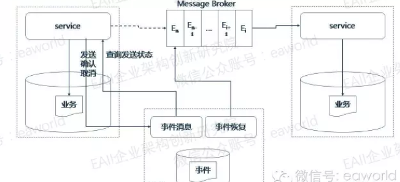

+++
title = "整体架构"
date = "2017-11-17"
draft = false
+++

## 流程

1. **业务服务A**在事务提交前，通过实时事件服务向**事件系统**请求发送事件，**事件系统**只记录事件并不真正发送。
2. **业务服务A**在提交后，通过实时事件服务向**事件系统**确认发送，事件得到确认后事件系统才真正发布事件到消息代理。**业务服务B**在消息代理中拿到消息并消费
3. **业务服务A**在业务回滚时，通过实时事件向**事件系统**取消事件。
4. 如果**业务服务A**在发送确认或取消之前停止服务了，**事件系统**的事件恢复服务会定期找到未确认发送的事件向业务服务查询状态，根据**业务服务A**返回的状态决定事件是要发布还是取消。

## 三部分

- **业务服务A**：封装了hap-event-helper方便使用

- **事件系统**：实现了hap-event-store-service

- **业务服务B**：封装了hap-event-consume-helper方便使用

---

## 完整demo
- [hap-event-demo-parent](https://rdc.hand-china.com/gitlab/HAPCloud/hap-event-demo-parent)