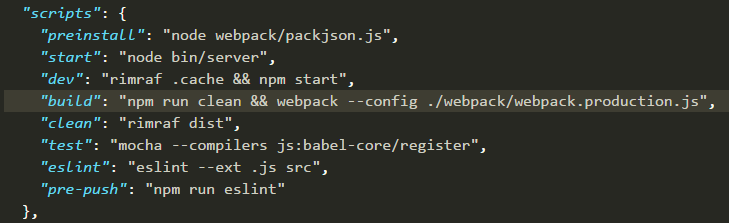

+++
title = "本地项目打包编译"
date = "2017-10-30"
draft = false
weight = 2
+++

# 本地项目打包编译
HAP Cloud项目默认打包编译在`boot`目录下，查看`boot`目录下的`package.json`文件


在`build`脚本中定义了本地打包编译的步骤。

* 先删除本地dist文件夹
* 执行webpack.production.js文件

在终端进入`boot`目录下执行命令
```
npm run build
```
成功之后会在`boot`目录下生成`dist`文件夹


