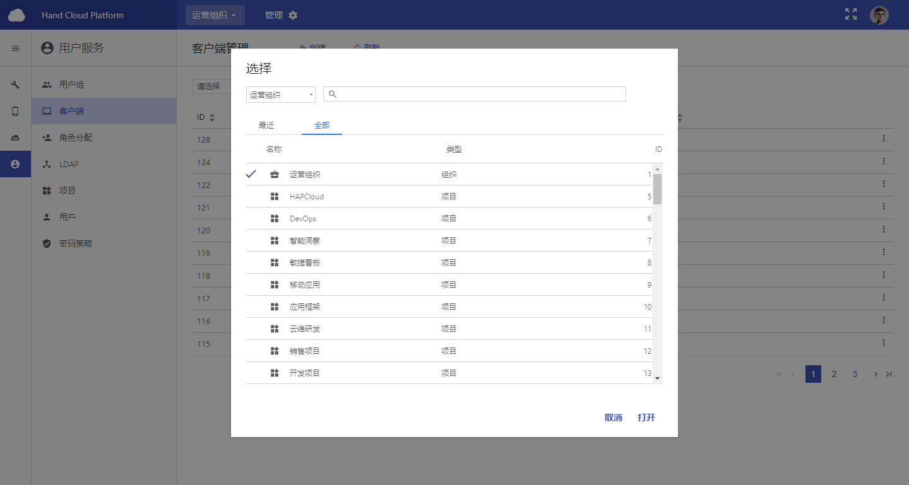

+++
title = "开放master之MenuType组件"
date = "2017-09-29"
draft = false
weight= 6
+++

# 开放master之MenuType组件

## 用途
MenuType组件用于选择当前所处的组织或项目



点击不同组织或项目将不同组织项目的服务和选项存储到menuStore里的menu字段中

## 使用方法
通过组件头部引用后，直接调用
```
...
import MenuType from 'MenuType';
...
return(
  <MenuType
    projectFlag={'true'}
    organizationFlag = {'true'}
  />
)
...
```

