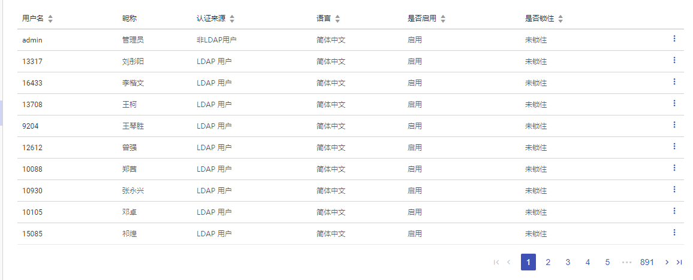

+++
title = "RePagination"
date = "2017-02-01"
draft = false
weight= 11
+++

# RePagination 分页组件

## 用途
RePagination分页组件为框架统一分页组件，为解决单页面数据量过多，提升用户体验的功能。



## 用法
在组件头部引用后直接调用
```
...
import RePagination from 'RePagination';
...
return (
  ...
  <RePagination
    total={ClientStore.getTotalSize}
    pageSize={10}
    current={this.state.page}
    onChange={(page) => {
      this.setState({ page: page })
      this.loadClient(page, this.state.params)
    }}
  />
  ...
)
```

参数 | 说明
--- | ---
total | 要分页数据的总数
pageSize | 一页显示的个数
current | 当前选中的页数
onChange | 点击页数的回调事件