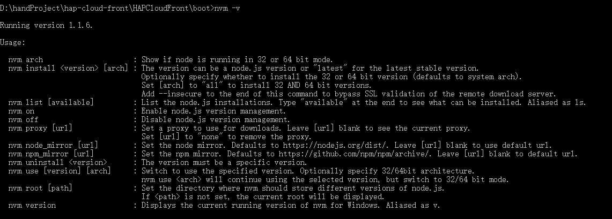

+++
title = "npm install失败"
date = "2017-02-01"
draft = false
weight= 1
+++

# npm install失败

## 情景
windows系统下由于node版本升级可能导致npm install出现如下图所示错误

## 解决办法

### 使用nvm node版本管理工具(推荐)
经过测试，node版本高于8.0.0会出现这个错误。
推荐使用nvm node版本管理工具动态切换node版本来解决这个问题

进入[nvm安装链接](https://github.com/coreybutler/nvm-windows/releases),下载nvm-setup.zip
安装完毕后，控制台输入nvm -v出现

说明nvm安装成功

在控制台键入nvm install 6.11.0

安装完后键入nvm use 6.11.0

成功将node版本切换到6.11.0

之后再npm install 就不会出现报错信息了