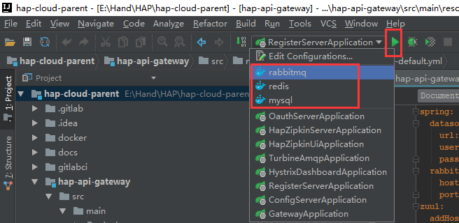

+++
title = "数据初始化"
date = "2017-02-01"
draft = false
weight = 1
+++

# 数据初始化

## 启动容器

在IDEA启动 `mysql`，`redis`，`rabbitmq` 容器



## 创建Mysql数据库

1.查看容器，确认存在容器名为mysql的容器:

```bash
$ docker ps
CONTAINER ID        IMAGE                                                          COMMAND                  CREATED             STATUS              PORTS                                                                                        NAMES
d616dd00797b        registry.saas.hand-china.com/tools/redis                       "/sbin/entrypoint.sh"    2 hours ago         Up 2 hours          0.0.0.0:6379->6379/tcp                                                                       redis
eda713caef09        registry.saas.hand-china.com/tools/rabbitmq:3.6.1-management   "/docker-entrypoin..."   2 hours ago         Up 2 hours          4369/tcp, 5671/tcp, 0.0.0.0:5672->5672/tcp, 15671/tcp, 25672/tcp, 0.0.0.0:15672->15672/tcp   rabbitmq
03ad58a5da5b        registry.saas.hand-china.com/tools/phpmyadmin                  "/run.sh phpmyadmin"     2 hours ago         Up 2 hours          0.0.0.0:80->80/tcp                                                                           phpmyadmin
d86c2bb3bd28        registry.saas.hand-china.com/tools/mysql:5.7.17                "docker-entrypoint..."   2 hours ago         Up 2 hours          0.0.0.0:3306->3306/tcp                                                                       mysql
```

2.用root用户命令行登陆 `mysql` 容器，密码为 `root`

```bash
docker exec -ti mysql mysql -uroot -p
```

3.创建用户和数据库:

```sql
CREATE USER 'hapcloud'@'%' IDENTIFIED BY "handhand";
CREATE DATABASE hap_user_service DEFAULT CHARACTER SET utf8;
CREATE DATABASE hap_framework_service DEFAULT CHARACTER SET utf8;
CREATE DATABASE hap_scheduler_service DEFAULT CHARACTER SET utf8;
CREATE DATABASE hap_cloud_test DEFAULT CHARACTER SET utf8;
CREATE DATABASE hap_zipkin_ui DEFAULT CHARACTER SET utf8;
GRANT ALL PRIVILEGES ON hap_user_service.* TO hapcloud@'%';
GRANT ALL PRIVILEGES ON hap_framework_service.* TO hapcloud@'%';
GRANT ALL PRIVILEGES ON hap_scheduler_service.* TO hapcloud@'%';
GRANT ALL PRIVILEGES ON hap_cloud_test.* TO hapcloud@'%';
GRANT ALL PRIVILEGES ON hap_zipkin_ui.* TO hapcloud@'%';
FLUSH PRIVILEGES;
```

## 初始化数据库

1.在git bash中通过命令进入 `hap-user-service` 目录和 `hap-framework-service-parent` 目录和`hap-scheduler-service`目录

2.执行命令:

```bash
sh init-local-database.sh
```

3.命令执行成功之后，刷新 `hap_user_service` 、   `hap_framework_service` 和 `hap_scheduler_service` 数据库，会出现初始化脚本中的表以及初始化数据

## repository信息安装

进入`hap-cloud-parent`子模块执行`mvn install`指令

## 开发分支

若要进行开发任务，希望确保与最新代码协作，请进入各个子模块使用`git checkout release-1.0.0`切换到当前的开发分支。