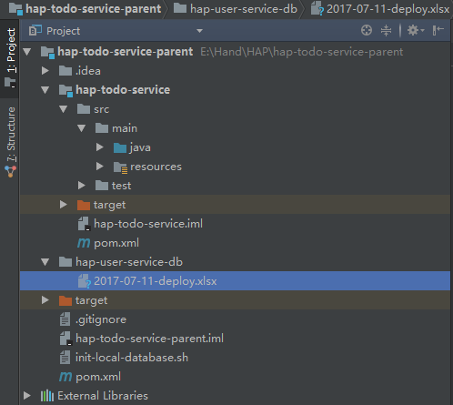

+++
title = "初始化数据库"
date = "2017-02-01"
draft = false
weight = 3
+++

# 初始化数据库

- 在Mysql管理工具中新建数据库与用户，并赋权限，sql如下：

```sql
CREATE USER 'hapdemo'@'%' IDENTIFIED BY "handhand";
CREATE DATABASE hap_demo_service_todo DEFAULT CHARACTER SET utf8;
GRANT ALL PRIVILEGES ON hap_demo_service_todo.* TO hapdemo@'%';
FLUSH PRIVILEGES;
```

- 编写执行脚本 `init-local-database.sh` 放在项目根目录下

```bash
#!/usr/bin/env bash

# 获取初始化数据库的jar包
mkdir -p target

if [ ! -f target/hap-liquibase-tools.jar ]
then
    curl http://nexus.saas.hand-china.com/content/repositories/rdc/com/hand/hap/cloud/hap-liquibase-tools/1.0/hap-liquibase-tools-1.0.jar -o target/hap-liquibase-tools.jar
fi

# 初始化项目数据库
java -Dspring.datasource.url="jdbc:mysql://localhost:3306/hap_demo_service_todo?useUnicode=true&characterEncoding=utf-8&useSSL=false" \
    -Dspring.datasource.username=hapdemo \
    -Dspring.datasource.password=handhand \
    -Ddata.init=true -Ddata.drop=true \
    -Ddata.dir=hap-todo-service/src/main/resources \
    -jar target/hap-liquibase-tools.jar

# 追加项目数据信息到hap-user-service数据库中
java -Dspring.datasource.url="jdbc:mysql://localhost:3306/hap_user_service?useUnicode=true&characterEncoding=utf-8&useSSL=false" \
    -Dspring.datasource.username=hapcloud \
    -Dspring.datasource.password=handhand \
    -Ddata.init=true \
    -Ddata.dir=hap-user-service-db \
    -jar target/hap-liquibase-tools.jar
```

- 脚本执行程序会自动扫描resources中的groovy数据库初始化文件以及excel初始化数据。
    * groovy脚本文件名要以编写时的日期开头，因为导入是按照文件名排序，这样可以保证导入顺序
    * groovy内的databaseChangeLog块内要有logicalFilePath参数为当前文件名
    * 新增的数据库修改一般要新建 changeSet，不可直接修改原来的changeSet，并且 id 值按以下案例规范操作，并写上作者 author 信息
    * 详细参考文档：
        - [参考文档](https://github.com/tlberglund/groovy-liquibase/blob/master/src/test/changelog/changelog.groovy)
        
- 在执行程序的参数中，`-Ddata.drop=true` 只能在本地开发环境使用，在正式环境必须设置为 `-Ddata.drop=false`
- groovy初始化数据库脚本 `2017-07-11-demo.groovy` 如下，在模块中的resources文件夹中新建db文件夹，放在该文件夹下：

```
package db

databaseChangeLog(logicalFilePath: '2017-05-11-demo.groovy') {
    changeSet(id: '2017-05-29-todo', author: 'zhuang.chang@hand-china.com') {
        createTable(tableName: "todo_user") {
            column(name: 'id', type: 'BIGINT UNSIGNED', remarks: 'ID', autoIncrement: true) {
                constraints(primaryKey: true)
            }
            column(name: 'employee_name', type: 'VARCHAR(32)', remarks: '员工名')
            column(name: 'employee_number', type: 'VARCHAR(32)', remarks: '员工号') {
                constraints(unique: true)
            }
            column(name: 'email', type: 'VARCHAR(32)', remarks: '邮箱')

            column(name: "OBJECT_VERSION_NUMBER", type: "BIGINT", defaultValue : "1")
            column(name: "CREATED_BY", type: "BIGINT", defaultValue : "-1")
            column(name: "CREATION_DATE", type: "DATETIME", defaultValueComputed : "CURRENT_TIMESTAMP")
            column(name: "LAST_UPDATED_BY", type: "BIGINT", defaultValue : "-1")
            column(name: "LAST_UPDATE_DATE", type: "DATETIME", defaultValueComputed : "CURRENT_TIMESTAMP")
        }
        createTable(tableName: "todo_task") {
            column(name: 'id', type: 'BIGINT UNSIGNED', remarks: 'ID', autoIncrement: true) {
                constraints(primaryKey: true)
            }
            column(name: 'employee_id', type: 'BIGINT', remarks: '员工ID')
            column(name: 'state', type: 'VARCHAR(36)', remarks: '状态')
            column(name: 'task_number', type: 'VARCHAR(64)', remarks: '任务编号') {
                constraints(unique: true)
            }
            column(name: 'task_description', type: 'VARCHAR(256)', remarks: '任务编号')

            column(name: "OBJECT_VERSION_NUMBER", type: "BIGINT", defaultValue : "1")
            column(name: "CREATED_BY", type: "BIGINT", defaultValue : "-1")
            column(name: "CREATION_DATE", type: "DATETIME", defaultValueComputed : "CURRENT_TIMESTAMP")
            column(name: "LAST_UPDATED_BY", type: "BIGINT", defaultValue : "-1")
            column(name: "LAST_UPDATE_DATE", type: "DATETIME", defaultValueComputed : "CURRENT_TIMESTAMP")
        }
        createTable(tableName: "todo_swimlane") {
            column(name: 'id', type: 'BIGINT UNSIGNED', remarks: 'ID', autoIncrement: true) {
                constraints(primaryKey: true)
            }
            column(name: 'state', type: 'VARCHAR(36)', remarks: '状态') {
                constraints(unique: true)
            }
            column(name: 'next_state', type: 'VARCHAR(36)', remarks: '下一状态')
        }
    }
}
```

- 初始化数据excel文档：在项目根目录下新建hap-user-service-db文件夹，放在该文件夹下。
    * [2017-07-11-demo.xls](https://rdc.hand-china.com/gitlab/HAPCloud/hap-todo-service-parent/blob/master/hap-user-service-db/2017-07-11-deploy.xlsx)
    * 具体编写规则见excel中 `README` sheet页。
    
- 结构图



- 准备好三个文件后，在项目根目录执行 `sh init-local-database.sh` 初始化数据库