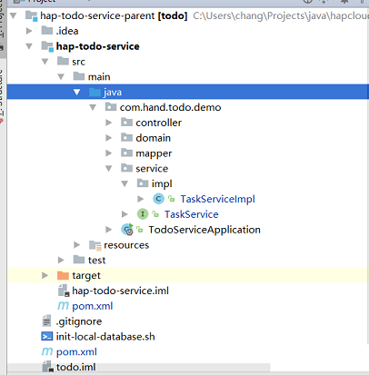

+++
title = "编写Service"
date = "2017-02-01"
draft = false
weight = 6
+++

# 编写Service

## Service 接口类

- Service 接口类定义了业务操作的一系列接口，并不提供实现，具体实现需要通过服务实现层提供，所以属于供应方的服务接口层。创建在 项目模块 的 xxx..service 包下。
- 每一个 Service 对应一个 domain 类，所以命名为domain 类名 + Service。如：UserService 对应表为 User 类。
- Service 接口，如无特殊例外，需要继承 BaseService< T > 接口,T 为 Service 本身

## Service 实现类

- Service 接口的具体实现通过服务实现层提供，所以属于供应方的服务实现层。创建在 项目模块 的 xxx..service.impl 包下。
- 实现类，如无特殊情况，需要用 @Service 标注，以自动扫描注册
- 实现类可以通过继承 BaseServiceImpl< T > 来获得标准的 CRUD 操作支持,需要 Service 接口类 继承 BaseServiceImpl< T >
- ServiceImpl 中对于 Mapper 的 CRUD 操作参照 基础 CRUD 操作。

## 代码



## 接口类 TaskService.java

```java
package com.hand.hap.cloud.todo.demo.service;

import com.hand.hap.cloud.mybatis.service.BaseService;
import com.hand.todo.demo.domain.TodoTask;

import java.util.List;

/**
 * Created by ziling.zhong on 2017/7/5.
 */
public interface TaskService extends BaseService<TodoTask>{

    TodoTask findByTaskNumber(String taskNumber);

    int delete(Long id);

    int deleteByTaskNumber(String taskNumber);

    TodoTask create(TodoTask task);

    TodoTask update(Long id, TodoTask task);

    List<TodoTask> findByTaskVersionNumber(Long objectVersionNumber);
}
```

## 实现类 TaskServiceImpl.java

```java
package com.hand.todo.demo.service.impl;

import com.hand.hap.cloud.mybatis.service.BaseServiceImpl;
import com.hand.hap.cloud.resource.exception.HapException;
import com.hand.todo.demo.domain.TodoTask;
import com.hand.todo.demo.service.TaskService;
import org.springframework.beans.factory.annotation.Autowired;
import org.springframework.stereotype.Service;
import org.springframework.transaction.annotation.Transactional;

import java.util.List;

/**
 * Created by ziling.zhong on 2017/7/5.
 */
@Service
@Transactional(rollbackFor = HapException.class)
public class TaskServiceImpl extends BaseServiceImpl<TodoTask> implements TaskService {

    @Override
    public TodoTask findByTaskNumber(String taskNumber) {
        TodoTask task = new TodoTask();
        task.setTaskNumber(taskNumber);
        List<TodoTask> tasks = select(task);
        if (!tasks.isEmpty()) {
            return tasks.get(0);
        }
        return null;
    }

    @Override
    public int delete(Long id) {
        TodoTask task = selectByPrimaryKey(id);
        if (task == null) {
            throw new HapException("error.todoTask.taskNumberExist");
        }
        return deleteByPrimaryKey(id);
    }

    @Override
    public int deleteByTaskNumber(String taskNumber) {
        TodoTask task = findByTaskNumber(taskNumber);
        if (task == null) {
            throw new HapException("error.todoTask.taskNumberExist");
        }
        return delete(task);
    }

    @Override
    public TodoTask create(TodoTask task) throws HapException {
        if (findByTaskNumber(task.getTaskNumber()) != null) {
            throw new HapException("error.todoTask.taskNumberExist");
        }
        if (insert(task) != 1) {
            throw new HapException("error.todoTask.insertNotOne");
        }
        return selectByPrimaryKey(task.getId());
    }

    @Override
    public TodoTask update(Long id, TodoTask task) {
        TodoTask oldTask = selectByPrimaryKey(id);
        if (oldTask == null) {
            throw new HapException("error.todoTask.notFound");
        }
        String taskNumber = task.getTaskNumber();
        if (taskNumber != null && !oldTask.getTaskNumber().equals(taskNumber)
                && findByTaskNumber(taskNumber) != null) {
            throw new HapException("error.todoTask.taskNumberExist");
        }
        task.setId(id);
        if (updateByPrimaryKeySelective(task) != 1) {
            throw new HapException("error.client.update");
        }
        return selectByPrimaryKey(id);
    }

    @Override
    public List<TodoTask> findByTaskVersionNumber(Long objectVersionNumber) {
        TodoTask task = new TodoTask();
        task.setObjectVersionNumber(objectVersionNumber);
        List<TodoTask> tasks = select(task);
        return tasks;
    }
}
```