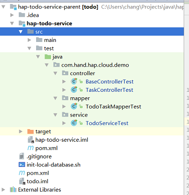

+++
title = "编写测试用例"
date = "2017-02-01"
draft = false
weight = 8
+++

# 编写测试用例

## Mapper测试

- @SpringBootTest:指定执行测试的SpringBootApplication
- TodoTaskMapperTest 代码

```java
package com.hand.hap.cloud.todo.demo.mapper;

import com.hand.hap.cloud.resource.exception.HapException;
import com.hand.todo.demo.TodoServiceApplication;
import com.hand.todo.demo.domain.TodoTask;
import com.hand.todo.demo.mapper.TodoTaskMapper;
import org.junit.Assert;
import org.junit.Test;
import org.junit.runner.RunWith;
import org.springframework.beans.factory.annotation.Autowired;
import org.springframework.boot.test.context.SpringBootTest;
import org.springframework.test.context.junit4.SpringRunner;
import org.springframework.transaction.annotation.Transactional;

import java.util.Date;

/**
 * Created by ziling.zhong on 2017/7/5.
 */
@RunWith(SpringRunner.class)
@SpringBootTest(classes = TodoServiceApplication.class)
@Transactional
public class TodoTaskMapperTest {
    @Autowired(required = false)
    private TodoTaskMapper taskMapper;

    private static TodoTask todoTask;
    private static Long employId;
    private static String taskNumber;
    private static String taskDescription;

    public static void taskSetValue() {
        todoTask.setEmployeeId(employId);
        todoTask.setTaskNumber(taskNumber);
        todoTask.setTaskDescription(taskDescription);
    }

//插入todoTask
    @Test
    public void test1Insert() {
        todoTask = new TodoTask();
        employId = new Long(1);
        taskNumber = "test-" + new Date().getTime();
        taskDescription = "testInsert";
        taskSetValue();
        //插入数据
        if (taskMapper.insertSelective(todoTask) != 1) {
            throw new HapException("error.client.insert");
        }
        todoTask = taskMapper.selectByPrimaryKey(todoTask.getId());
        Assert.assertEquals(employId, todoTask.getEmployeeId());
        Assert.assertEquals(taskNumber, todoTask.getTaskNumber());
        Assert.assertEquals(taskDescription, todoTask.getTaskDescription());
    }

//更新todoTask
    @Test
    public void test2Update() {
        test1Insert();
        employId = new Long(2);
        taskNumber = "test-" + new Date().getTime();
        taskDescription = "testUpdate";
        taskSetValue();
        if (taskMapper.updateByPrimaryKeySelective(todoTask) != 1) {
            throw new HapException("error.client.update");
        }
        todoTask = taskMapper.selectByPrimaryKey(todoTask.getId());
        Assert.assertEquals(employId, todoTask.getEmployeeId());
        Assert.assertEquals(taskNumber, todoTask.getTaskNumber());
        Assert.assertEquals(taskDescription, todoTask.getTaskDescription());
    }

//删除todoTask
    @Test
    public void test99Delete() {
        test1Insert();
        if (taskMapper.deleteByPrimaryKey(todoTask.getId()) != 1) {
            throw new HapException("error.client.delete");
        }
        Assert.assertNull(taskMapper.selectByPrimaryKey(todoTask.getId()));
    }
}
```

- TodoServiceTest

```java
package com.hand.hap.cloud.todo.demo.service;
import com.hand.hap.cloud.resource.exception.HapException;
import com.hand.todo.demo.TodoServiceApplication;
import com.hand.todo.demo.domain.TodoTask;
import com.hand.todo.demo.service.TaskService;
import org.junit.Assert;
import org.junit.Test;
import org.junit.runner.RunWith;
import org.springframework.beans.factory.annotation.Autowired;
import org.springframework.boot.test.context.SpringBootTest;
import org.springframework.test.context.junit4.SpringRunner;
import org.springframework.transaction.annotation.Transactional;

import java.util.Date;
import java.util.List;

/**
 * Created by ziling.zhong on 2017/7/5.
 */
@RunWith(SpringRunner.class)
@SpringBootTest(classes = TodoServiceApplication.class)
@Transactional
public class TodoServiceTest {

    @Autowired
    private TaskService taskService;

    private static TodoTask todoTask;
    private static String taskNumber;
    private static Long employId;
    private static String taskDescription;

    public static void taskSetValue() {
        todoTask.setEmployeeId(employId);
        todoTask.setTaskNumber(taskNumber);
        todoTask.setTaskDescription(taskDescription);
    }

    @Test
    public void test1Create() {
        todoTask = new TodoTask();
        taskNumber = "test-" + new Date().getTime();
        employId = new Long(1);
        taskDescription = "testInsert";
        String taskState = "testState";
        taskSetValue();
        todoTask.setState(taskState);
        //创建后数据会回写，最终调用insertSelective(T)
        if (taskService.create(todoTask) == null) {
            throw new HapException("error.client.create");
        }
        todoTask = taskService.selectByPrimaryKey(todoTask.getId());
        Assert.assertEquals(employId, todoTask.getEmployeeId());
        Assert.assertEquals(taskNumber, todoTask.getTaskNumber());
        Assert.assertEquals(taskDescription, todoTask.getTaskDescription());
        Assert.assertEquals(taskState, todoTask.getState());
    }

    @Test
    public void test2FindByTaskNumber() {
        test1Create();
        todoTask = taskService.findByTaskNumber(todoTask.getTaskNumber());
        Assert.assertEquals(employId, todoTask.getEmployeeId());
        Assert.assertEquals(taskNumber, todoTask.getTaskNumber());
        Assert.assertEquals(taskDescription, todoTask.getTaskDescription());
    }

    @Test
    public void test3FindByVersionNumber() {
        for (int i = 0; i < 3; i++) {
            test1Create();
        }
        List<TodoTask> todoTasks = taskService.findByTaskVersionNumber(new Long(1));
        Assert.assertFalse(todoTasks.isEmpty());
    }

    @Test
    public void test4Update() {
        test1Create();
        todoTask = taskService.selectByPrimaryKey(todoTask.getId());
        taskNumber = "testService2-" + new Date().getTime();
        taskDescription = "testServiceUpdate2";
        employId = new Long(2);
        taskSetValue();
        if (taskService.updateByPrimaryKeySelective(todoTask) != 1) {
            throw new HapException("error.client.update");
        }
        todoTask = taskService.selectByPrimaryKey(todoTask.getId());
        Assert.assertEquals(employId, todoTask.getEmployeeId());
        Assert.assertEquals(taskNumber, todoTask.getTaskNumber());
        Assert.assertEquals(taskDescription, todoTask.getTaskDescription());
    }

    @Test
    public void test99Delete() {
        test1Create();
        Assert.assertNotNull(taskService.selectByPrimaryKey(todoTask.getId()));
        if (taskService.deleteByPrimaryKey(todoTask.getId()) != 1) {
            throw new HapException("error.client.delete");
        }
        Assert.assertNull(taskService.selectByPrimaryKey(todoTask.getId()));
    }

    @Test
    public void test999DeleteByTaskNumber() {
        test1Create();
        Assert.assertNotNull(taskService.selectByPrimaryKey(todoTask.getId()));
        if (taskService.deleteByTaskNumber(todoTask.getTaskNumber()) != 1) {
            throw new HapException("error.client.delete");
        }
        Assert.assertNull(taskService.selectByPrimaryKey(todoTask.getId()));
    }
}
```

## controller测试

- BaseControllerTest

```java
package com.hand.hap.cloud.todo.demo.controller;

import com.fasterxml.jackson.databind.ObjectMapper;
import com.hand.todo.demo.TodoServiceApplication;
import org.junit.Before;
import org.junit.runner.RunWith;
import org.springframework.beans.factory.annotation.Autowired;
import org.springframework.boot.test.context.SpringBootTest;
import org.springframework.boot.test.web.client.TestRestTemplate;
import org.springframework.http.HttpRequest;
import org.springframework.http.client.ClientHttpRequestExecution;
import org.springframework.http.client.ClientHttpRequestInterceptor;
import org.springframework.http.client.ClientHttpResponse;
import org.springframework.test.context.junit4.SpringRunner;

import java.io.IOException;

/**
 * Created by chang on 2017/5/20.
 */
@RunWith(SpringRunner.class)
@SpringBootTest(webEnvironment = SpringBootTest.WebEnvironment.RANDOM_PORT, classes = TodoServiceApplication.class)
public abstract class BaseControllerTest {

    private final static String TOKEN = "eyJhbGciOiJIUzI1NiIsInR5cCI6IkpXVCJ9" +
            ".eyJwYXNzd29yZCI6InVua25vd24gcGFzc3dvcmQiLCJ1c2VybmFtZSI6ImFkbWl" +
            "uIiwiYXV0aG9yaXRpZXMiOltdLCJhY2NvdW50Tm9uRXhwaXJlZCI6dHJ1ZSwiYWN" +
            "jb3VudE5vbkxvY2tlZCI6dHJ1ZSwiY3JlZGVudGlhbHNOb25FeHBpcmVkIjp0cnV" +
            "lLCJlbmFibGVkIjp0cnVlLCJ1c2VySWQiOjEsInRpbWVab25lIjoiQ1RUIiwibGF" +
            "uZ3VhZ2UiOiJ6aF9DTiIsIm9yZ2FuaXphdGlvbklkIjoxLCJwcm9qZWN0SWQiOjE" +
            "sImFkZGl0aW9uSW5mbyI6bnVsbH0.g2kWetvUZTytG-umdGm1JKiAvAb9RV6B7Dy" +
            "44ef9qRI";

    private static boolean first = true;

    @Autowired
    protected TestRestTemplate restTemplate;

    protected final static ObjectMapper MAPPER = new ObjectMapper();

    @Before
    public void before() {
        if (first) {
            restTemplate.getRestTemplate().getInterceptors().add(new OAuthAuthorizationInterceptor(TOKEN));
            first = false;
        }
    }

    class OAuthAuthorizationInterceptor implements ClientHttpRequestInterceptor {
        private final String token;

        private OAuthAuthorizationInterceptor(String token) {
            this.token = token;
        }

        public ClientHttpResponse intercept(HttpRequest request, byte[] body, ClientHttpRequestExecution execution) throws IOException {
            request.getHeaders().add("Authorization", "Bearer " + token);
            return execution.execute(request, body);
        }
    }
}
```

- TaskControllerTest

```java
package com.hand.hap.cloud.todo.demo.controller;

import com.hand.todo.demo.domain.TodoTask;
import org.junit.Assert;
import org.junit.FixMethodOrder;
import org.junit.Test;
import org.junit.runners.MethodSorters;
import org.springframework.http.HttpStatus;

import java.util.Date;
import java.util.List;
import java.util.Map;


/**
 * Created by ziling.zhong on 2017/7/5.
 */
@FixMethodOrder(MethodSorters.NAME_ASCENDING)
public class TaskControllerTest extends BaseControllerTest {

    private static TodoTask target;

    @Test
    public void test1Create() throws Exception {
        TodoTask todoTask = new TodoTask();
        String taskNumber = "testController" + new Date().getTime();
        Long employId = new Long(1);
        String taskDescription = "testControllerInsert";
        String taskState = "taskState";
        todoTask.setEmployeeId(employId);
        todoTask.setTaskNumber(taskNumber);
        todoTask.setTaskDescription(taskDescription);
        todoTask.setState(taskState);
        target = restTemplate.postForEntity("/v1/todoTask/create", todoTask, TodoTask.class).getBody();
        Assert.assertEquals(employId, target.getEmployeeId());
        Assert.assertEquals(taskNumber, target.getTaskNumber());
        Assert.assertEquals(taskDescription, target.getTaskDescription());
        Assert.assertEquals(taskState, target.getState());
    }

    @Test
    public void test2FindByNumber() throws Exception {
        TodoTask todoTask = restTemplate.getForEntity("/v1/todoTask/findByNumber/{taskNumber}", TodoTask.class, target.getTaskNumber()).getBody();
        Assert.assertEquals(todoTask.getEmployeeId(), target.getEmployeeId());
        Assert.assertEquals(todoTask.getTaskNumber(), target.getTaskNumber());
        Assert.assertEquals(todoTask.getTaskDescription(), target.getTaskDescription());
    }

//由于TodoTask类继承AuditDomain基类，在更新数据通过Controller层调用时会进行审计，其它层不用考虑
//此时在提交的数据target中必须包含objectVersionNumber字段，并给该字段赋予数据库中的数据。
    @Test
    public void test3Update() throws Exception {
        target.setState("Yes");
        //更新数据
        restTemplate.put("/v1/todoTask/{id}", target, target.getId());
        TodoTask todoTask = restTemplate.getForEntity("/v1/todoTask/findByNumber/{taskNumber}", TodoTask.class, target.getTaskNumber()).getBody();
        Assert.assertEquals(target.getState(), todoTask.getState());
    }

    @Test
    public void test4FindByVersionNumber() throws Exception {
        Map result = restTemplate.getForEntity("/v1/todoTask/findByVersionNumber/{objectVersionNumber}", Map.class, target.getObjectVersionNumber()).getBody();
        Assert.assertFalse(result.isEmpty());
        Assert.assertNotNull(result.get("tasks"));
    }

//    @Test
//    public void test4FindByVersionNumber() throws Exception {
//        List result = restTemplate.getForEntity("/v1/todoTask/findByVersionNumber/{objectVersionNumber}", List.class, target.getObjectVersionNumber()).getBody();
//        Assert.assertFalse(result.isEmpty());
//    }

    @Test
    public void test99DeleteById() throws Exception {
        restTemplate.delete("/v1/todoTask/{id}", target.getId());
        HttpStatus status = restTemplate.getForEntity("/v1/todoTask/findByNumber/{taskNumber}", TodoTask.class, target.getTaskNumber()).getStatusCode();
        Assert.assertEquals(HttpStatus.BAD_REQUEST, status);
    }

    @Test
    public void test999DeleteByNumber() throws Exception {
        test1Create();
        restTemplate.delete("/v1/todoTask/taskNumber/{taskNumber}", target.getTaskNumber());
        HttpStatus status = restTemplate.getForEntity("/v1/todoTask/findByNumber/{taskNumber}", TodoTask.class, target.getTaskNumber()).getStatusCode();
        Assert.assertEquals(HttpStatus.BAD_REQUEST, status);
    }
}
```

## 目录结构



## 运行测试

```
mvn clean compile test -DskipTests=false
```