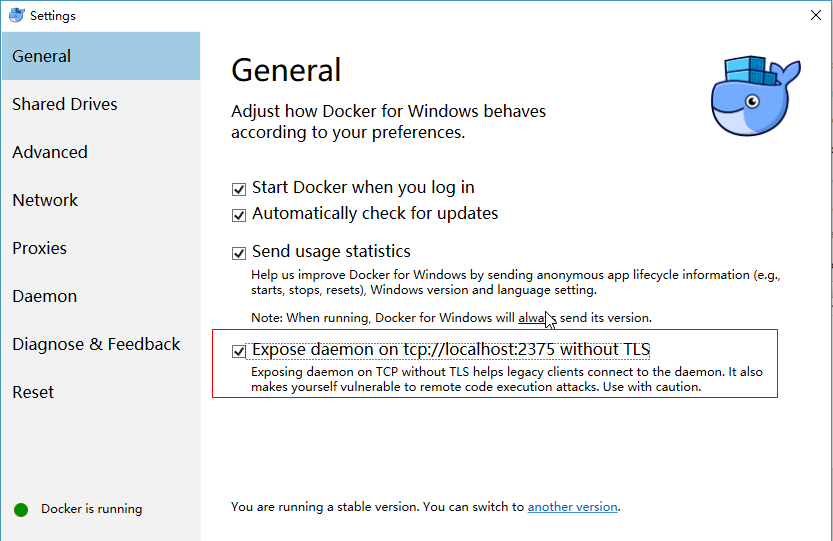
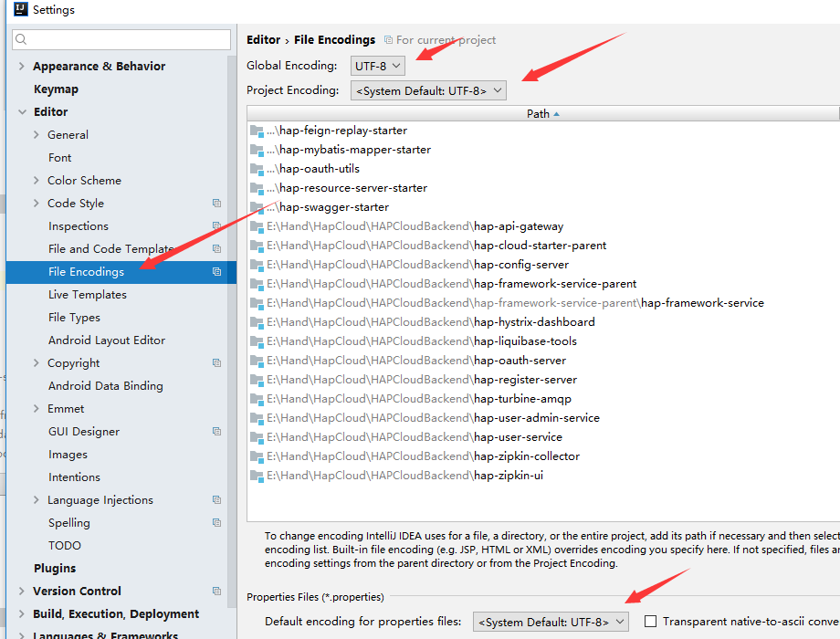
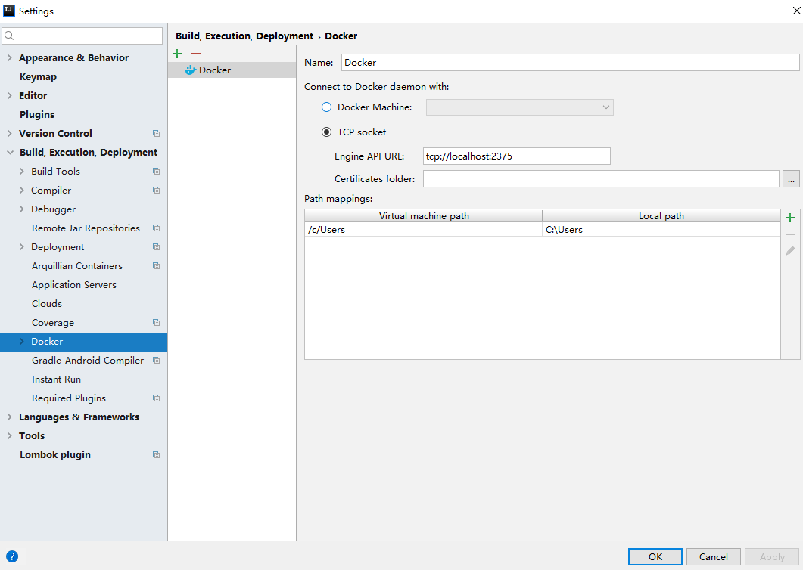
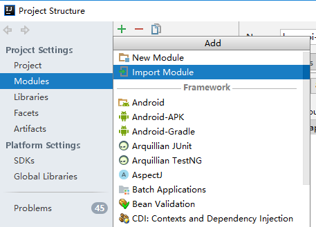
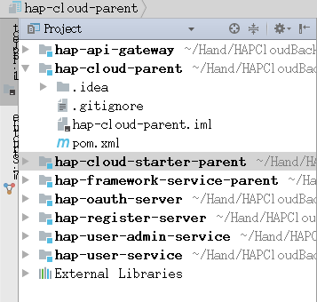
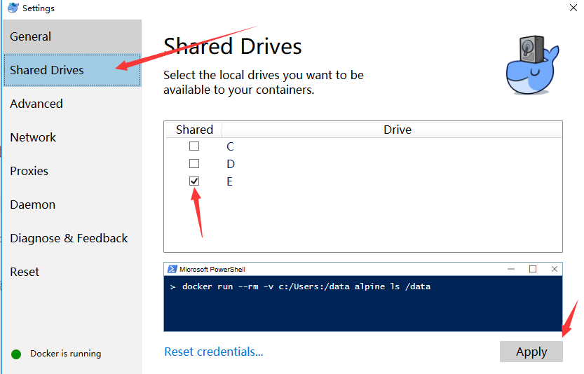
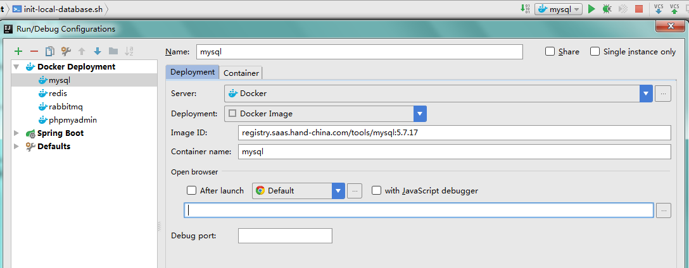
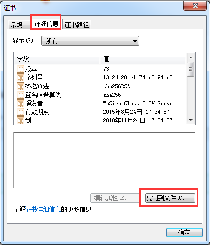

+++
title = "软件安装(Windows)"
date = "2017-02-01"
draft = false
weight = 1
+++

# 软件安装

## 开发工具

- Git
- JDK 1.8.0 及以上
- maven 3.3 及以上
- Docker for Windows
- IntelliJ IDEA
- Mysql
- Rabbit MQ
- Redis
- Phpmyadmin (可选)
- Visual Studio Code (可选)

## Git 安装

1. 在 [Git 官网](https://git-scm.com/download/) 下载对应平台的 Git。
1. 本地执行安装文件，安装 Git 环境。
1. 配置完成后打开 git bash 执行 `git` ，有提示则说明环境安装成功。

### 配置

```bash
curl -o ~/.gitconfig -SL https://raw.githubusercontent.com/carllhw/dotfiles/master/.gitconfig-others
# 请将下面命令按实际情况进行执行
git config --global user.name "Your Name"
git config --global user.email "Your Email"
```

## Java 安装

1. 在 [Oracle 官网](https://www.oracle.com/technetwork/cn/java/javase/downloads/index.html) 下载对应平台的 JDK 1.8.0 以上的环境。
1. 本地执行安装文件，安装 JDK 环境。
1. Win 在环境变量系统变量中 path 配置 JDK 的环境变量指向 JDK 安装目录下 `JDK/bin`，并配置环境变量 `JAVA_HOME`。
1. 配置完成后打开 git bash 执行 `java` ，有提示则说明环境安装成功。(git bash执行会有乱码，cmd则正常)

## Maven 安装

1. 在 [Maven 官网](http://mirror.bit.edu.cn/apache/maven/) 下载对应平台的合适的 maven 版本的压缩包。
1. 本地解压压缩包。
1. Win 在环境变量中系统变量的 path 配置 maven 的环境变量指向 maven 解压目录下的 `/bin` 。
1. 配置完成后打开 git bash 执行 `mvn -v` ，有提示则说明环境安装成功。

## Docker for Windows 安装


1. 在 [Docker for Windows](https://www.docker.com/docker-windows) 下载安装包
1. 本地执行安装文件，安装Docker
1. 启动Docker，然后会提示启用Hyper-V需要重启
1. 重启后Docker会自动启动
1. 打开 git bash 执行 `docker --version` ，有提示则说明环境安装成功。

**Note. 注意要使用Docker for Windows，机器必须开启虚拟化支持，部分机型默认禁用，需进入bios进行设置，因各机型设置不相一致，在此不做详细说明**

### Docker配置



## IntelliJ IDEA 安装配置

在 `IDEA官网` 下载与本机系统相符的安装包，并安装。

### Idea配置

1. 菜单栏File > Setting打开设置, Editor > Code Style > Line separator (for new lines): Unix and OS X (n)

    

1. 确保idea使用utf-8编码

    

1. 安装Docker插件。在File-Settings-Plugins中，搜索Docker integration，点击Install安装，并重启软件加载插件。

    

    **因网络原因，可能导致下载失败，若一直不能下载成功，可跳过Idea关于Docker的相关配置步骤，在下方关于Docker容器启动方式选择第二种——docker-compose**

1. IDEA中配置Docker，在File-Settings-Build,Execution,Deployment-Clouds中，点击加号新建，会自动读取docker信息，直接保存即可。

    

## 克隆代码

### 克隆代码到本地

1. 使用 `git clone https://rdc.hand-china.com/gitlab/HAPCloud/HAPCloudBackend.git` 将项目 clone 到本地
1. 进入项目中执行`git submodule update --init --recursive`命令将所有后端子模块初始化。

### 导入项目到IDEA开发工具中

打开已安装好的IDEA开发工具，将clone到本地的项目导入到开发工具IDEA中，会自动下载依赖包。

因为各模块分离，故而可通过idea的File > Project Structure添加各模块





## 服务环境准备

### 准备

在E:\Docker\mysql下新建mysql_data文件夹，同时新建一个mysql_db.cnf文件，内容如下

```
[mysqld]
lower_case_table_names=1
character_set_server=utf8
max_connections=500
```

也可在其他位置创建，但需注意与下方使用该配置文件时的路径相对应。

注意：因为要将docker容器中的mysql文件映射到本机上，若使用docker for windows，需要通过右键系统菜单栏的docker图标 > settings > Shared Drives 对卷绑定的驱动盘进行勾选



### 安装

首先，打开cmd或者powershell分别执行以下指令，对所需的Docker镜像进行拉取。

```bash
docker pull registry.saas.hand-china.com/tools/mysql:5.7.17
docker pull registry.saas.hand-china.com/tools/rabbitmq:3.6.1-management
docker pull registry.saas.hand-china.com/tools/redis
docker pull registry.saas.hand-china.com/tools/phpmyadmin
```

### 启动Docker容器

以下两种方式任选一种进行

#### 1. Idea启动Docker

##### MySQL配置

- Name: mysql
- Docker Deployment

    ```
    Server: Docker
    Deployment: Docker Image
    Image ID: registry.saas.hand-china.com/tools/mysql:5.7.17
    Container name: mysql
    ```

- Docker Container

  - Port bindings

    Container Port | Protocol | Host IP | Host Port
    ---|---|---|---
    3306 | tcp |  | 3306

  - Volume bindings

    Container Path | Host path | Read only
    ---|---|---
    /var/lib/mysql | E:/Docker/mysql/mysql_data |
    /etc/mysql/conf.d/mysql_db.cnf | E:/Docker/mysql/mysql_db.cnf |

    Host path 可以根据自己需求自己选择映射位置，第一项为mysql的数据存放文件夹，第二项为mysql的配置文件，请确保确映射类型对应且必须存在。

  - Environment variables

    Name | value
    ---|---
    MYSQL_ROOT_PASSWORD | root

  

  

##### Rabbit MQ配置

- Name: rabbitmq
- Docker Deployment

    ```
    Server: Docker
    Deployment: Docker Image
    Image ID: registry.saas.hand-china.com/tools/rabbitmq:3.6.1-management
    Container name: rabbitmq
    ```

- Docker Container

  - Port bindings

    Container Port | Protocol | Host IP | Host Port
    ---|---|---|---
    15672 | tcp |  | 15672
    5672 | tcp |  | 5672

    

    

##### Redis配置

- Name: redis
- Docker Deployment

    ```
    Server: Docker
    Deployment: Docker Image
    Image ID: registry.saas.hand-china.com/tools/redis
    Container name: redis
    ```

- Docker Container

  - Port bindings

    Container Port | Protocol | Host IP | Host Port
    ---|---|---|---
    6379 | tcp |  | 6379

    

    

###### phpadmin

- Name: phpmyadmin
- Docker Deployment

    ```
    Server: Docker
    Deployment: Docker Image
    Image ID: registry.saas.hand-china.com/tools/phpmyadmin
    Container name: phpmyadmin
    ```

- Docker Container

  - Port bindings

    Container Port | Protocol | Host IP | Host Port
    ---|---|---|---
    80 | tcp |  | 80

  - Environment variables

    Name | value
    ---|---
    PMA_ARBITRARY | 1

    

    

#### 2. 通过docker-compose来启动docker

在E:\Docker新建docker-compose.yml文件内容如下:

```yaml
version: "3"
services:
  mysql:
    container_name: mysql  # 容器名
    image: registry.saas.hand-china.com/tools/mysql:5.7.17 # 容器所使用的镜像，镜像形式为[username 或 url]/repository:tag，该镜像为公司搭设的docker仓库内的镜像
    ports:
      - "3306:3306" # [本机端口:容器内端口] 将本机端口与docker容器内部应用的端口映射，以提供外部对容器内应用的访问能力
    environment:
      MYSQL_ROOT_PASSWORD: root # 设置mysql密码
    volumes:
      - ./mysql/mysql_data:/var/lib/mysql # 将mysql中的数据文件映射到本机文件夹，":"前的为本机地址，后的为容器内地址
      - ./mysql/mysql_db.cnf:/etc/mysql/conf.d/mysql_db.cnf # 将mysql的配置文件映射到本机文件
  rabbitmq:
    container_name: rabbitmq
    image: registry.saas.hand-china.com/tools/rabbitmq:3.6.1-management
    ports:
      - "15672:15672"
      - "5672:5672"
  redis:
    container_name: redis
    image: registry.saas.hand-china.com/tools/redis
    ports:
      - "6379:6379"
  phpadmin:
    container_name: phpadmin
    image: registry.saas.hand-china.com/tools/phpmyadmin
    ports:
      - "80:80" # 80端口方便浏览器直接访问
    environment:
      PMA_ARBITRARY: 1 # 用于开启phpadmin关于可否输入host的设置
```

启动cmd或powershell，通过cd命令跳转至E:\Docker目录下，执行`docker-compose.exe up -d`启动docker服务，通过`docker ps`查看容器是否启动。若需要停止，同样在该目录下执行`docker-compose.exe down`


有关Docker的更多信息请见[此处](https://docs.docker.com/)

有关Docker-Compose的更多信息请见[此处](https://docs.docker.com/compose/overview/)

## Visual Studio Code (可选)

1.在 [vscode](https://code.visualstudio.com/) 官网 下载对应平台的安装包。

2.本地执行安装文件，安装。安装时可以选择 添加到PATH，重启后可以在Git Bash直接用code命令来打开目录或文件。

### VSCode配置

文件 > 首选项 > 设置

```json
// Place your settings in this file to overwrite the default settings
{
    "files.eol": "\n",
    "editor.formatOnSave": true
}
```

## 导入安全证书到JDK

1.获取需要的安全证书的网页URL, 然后在浏览器中打开

2.在浏览器中右击检查，然后选中 `security` ,点击 `View Certificate`


3.从上述步骤进入证书之后，点击详细信息，然后复制到文件



4.然后依次按着向导导出证书到本地，导出成功后如下图


5.从证书的位置右击进入命令窗口，执行命令:

  ```
  keytool -import -v -trustcacerts -alias test2 -file test2.cer -storepass changeit -keystore "%JAVA_HOME%/jre/lib/security/cacerts"
  ```

> 注：此处文件名称需要改为自己本地证书的名称

6.上述命令执行完成后会提示是否信任此证书，输入 `Y` 证书将被添加进JDK

