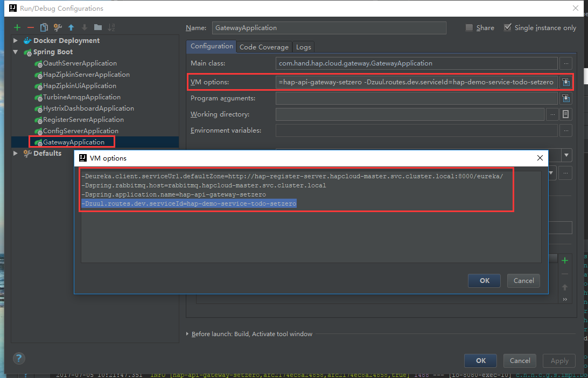

+++
title = "本地环境搭建"
date = "2017-02-01"
draft = false
weight = 3
+++

# 本地环境搭建

## OpenVPN

使用OpenVPN连接服务器，保证可以直接使用openshift服务域名访问对应服务。

[OpenVPN下载](https://openvpn.net/index.php/open-source/downloads.html) （网络原因，请自备梯子）

## 安装本地服务

本地需要安装，mysql 和 redis 与服务器数据隔离，按照本地开发方法进行数据初始化。

## 修改服务启动参数

本地只需要启动 hap-api-gateway 和开发者正在开发的服务，并添加启动参数，使其使用服务器上的服务，服务和对应参数如下：

- 注册服务: `-Deureka.client.serviceUrl.defaultZone=http://hap-register-server.hapcloud-master.svc.cluster.local:8000/eureka/`
- Rabbit MQ: `-Dspring.rabbitmq.host=rabbitmq.hapcloud-master.svc.cluster.local`
- 服务名称: `-Dspring.application.name=hap-api-gateway-yourname`
- Gateway路由服务: `-Dzuul.routes.dev.serviceId=hap-demo-service-todo-yourname`

1. 只要是 spring boot application.yml 中的参数都可以按照这种方法用命令行参数替换。
2. MySQL和Redis也可以同样方法直接使用服务器上的，但是要注意保护数据不被破坏。
3. 需要注意的是本地启动的服务服务名称必须加后缀替换，不能与服务器上冲突。

## 访问API

通过参数 `-Dzuul.routes.dev.serviceId=hap-demo-service-todo-yourname`， API Gateway会将路由 `/dev` 转发到目标服务，用于开发使用。

若需多个路由，自行修改application-default.yml文件，但不要提交代码库。

查看服务是否注册成功：[http://hap-register-server.hapcloud-master.svc.cluster.local:8000/](http://hap-register-server.hapcloud-master.svc.cluster.local:8000/)

访问swagger：[http://localhost:8080/swagger-ui.html](http://localhost:8080/swagger-ui.html)