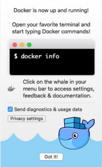
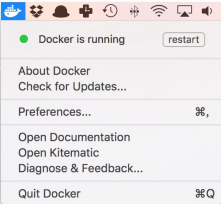
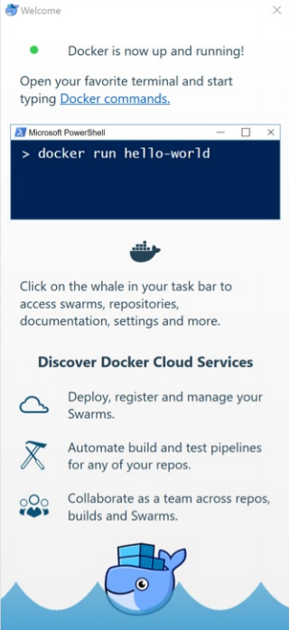

+++
title = "环境安装"
date = "2017-10-30"
draft = false
weight = 1
+++

# 环境安装
HAP Cloud项目具有持续集成，持续部署功能。在项目根目录的`.gitlab-ci.yml`文件中，写明了项目提交到`gitlab`之后,gitlab ci执行的一系列打包编译工作，并且使用`docker`打包新项目镜像到远程地址。然后登录`openshift`，拉取远程镜像实现持续部署。

这一套流程是不需要本地安装部署环境的，但如果本地开发想要`npm run build`生成打包文件，并在本地`docker build & push`一个新的镜像，并自定义`deployment.yml`文件部署`openshift`的话，需要在本地进行如下环境安装。

## docker安装

### Ubuntu安装Docker

#### Docker 支持以下版本的`Ubuntu`操作系统

* Zesty 17.04
* Xenial 16.04(LTS)
* Trusty 14.04(LTS)

#### 使用APT镜像源安装

由于官方源使用 HTTPS 以确保软件下载过程中不被篡改。因此，我们首先需要添
加使用 `HTTPS` 传输的软件包以及 CA 证书。
```
$ sudo apt-get update
$ sudo apt-get install \
apt-transport-https \
ca-certificates \
curl \
software-properties-common
```

鉴于国内网络问题，强烈建议使用国内源，下面先介绍国内源的使用。
国内源
为了确认所下载软件包的合法性，需要添加软件源的 GPG 密钥。

```
$ curl -fsSL https://mirrors.aliyun.com/docker-ce/linux/ubuntu/gpg | sudo apt-key add -
```
然后，我们需要向 source.list 中添加 Docker 软件源
```
$ sudo add-apt-repository \
  "deb [arch=amd64] https://mirrors.aliyun.com/docker-ce/linux/ubuntu \
  $(lsb_release -cs) \
  stable"
```
以上命令会添加稳定版本的 Docker CE APT 镜像源，如果需要最新版本的
Docker CE 请将 `stable` 改为 `edge` 或者 `test`。从 Docker 17.06 开始，edge
test 版本的 APT 镜像源也会包含稳定版本的 Docker。

官方源
```
$ curl -fsSL https://download.docker.com/linux/ubuntu/gpg | sudo apt-key add -
$ sudo add-apt-repository \
"deb [arch=amd64] https://download.docker.com/linux/ubuntu \
$(lsb_release -cs) \
stable"
```

#### 安装Docker
更新apt软件包缓存，并安装docker-ce:
```
$ sudo apt-get update
$ sudo apt-get install docker-ce
```

#### 使用脚本自动安装
在测试或开发环境中 Docker 官方为了简化安装流程，提供了一套便捷的安装脚
本，Ubuntu 系统上可以使用这套脚本安装：
```
$ curl -fsSL get.docker.com -o get-docker.sh
$ sudo sh get-docker.sh --mirror Aliyun
```
执行这个命令后，脚本就会自动的将一切准备工作做好，并且把 Docker 安装在系
统中。

#### 启动Docker
```
$ sudo systemctl enable docker
$ sudo systemctl start docker
```
Ubuntu 14.04请使用以下命令启动：
```
$ sudo service docker start
```

#### 建立docker用户组
默认情况下， docker 命令会使用 Unix socket 与 Docker 引擎通讯。而只有
root 用户和 docker 组的用户才可以访问 Docker 引擎的 Unix socket。出于
安全考虑，一般 Linux 系统上不会直接使用 root 用户。因此，更好地做法是将
需要使用 docker 的用户加入 docker 用户组。
建立 docker 组：
```
$ sudo groupadd docker
```
将当前用户加入 docker 组：
```
$ sudo usermod -aG docker $USER
```

### macOS 安装Docker
#### 系统要求
Docker for Mac 要求系统最低为 macOS 10.10.3 Yosemite，或者 2010 年以后的
Mac 机型，准确说是带 Intel MMU 虚拟化的，最低 4GB 内存。
如果系统不满足需求，可以安装 Docker Toolbox。

#### 安装

##### 使用 Homebrew 安装

Homebrew 的 Cask 已经支持 Docker for Mac，因此可以很方便的使用 Homebrew
Cask 来进行安装：
```
brew cask install docker
```

##### 手动下载安装

如果需要手动下载，可以通过这个链接下
载：https://download.docker.com/mac/stable/Docker.dmg
如同 macOS 其它软件一样，安装也非常简单，双击下载的 .dmg 文件，然后将
那只叫 Moby 的鲸鱼图标拖拽到 Application 文件夹即可（其间可能会询问系
统密码）。


##### 运行

从应用中找到 Docker 图标并点击运行。


运行之后，会在右上角菜单栏看到多了一个鲸鱼图标，这个图标表明了 Docker 的
运行状态。


第一次点击图标，可能会看到这个安装成功的界面，点击 "Got it!" 可以关闭这个窗
口。



以后每次点击鲸鱼图标会弹出操作菜单。



启动终端后，通过命令可以检查安装后的 Docker 版本。
```
$ docker --version
Docker version 1.12.3, build 6b644ec
$ docker-compose --version
docker-compose version 1.8.1, build 878cff1
$ docker-machine --version
docker-machine version 0.8.2, build e18a919
```
如果 docker version 、 docker info 都正常的话，可以运行一个 Nginx 服务
器：
```
$ docker run -d -p 80:80 --name webserver nginx
```
服务运行后，可以访问 http://localhost，如果看到了 "Welcome to nginx!"，就说明
Docker for Mac 安装成功了。


### Windows 安装Docker

#### 系统要求
Docker CE 支持 64 位版本的 Windows 10 Pro，且必须开启 Hyper-V。
#### 安装
点击以下链接下载 [stable](https://download.docker.com/win/stable/Docker%20for%20Windows%20Installer.exe) 或 [edge](https://download.docker.com/win/edge/Docker%20for%20Windows%20Installer.exe) 版本的 Docker CE。
下载好之后双击 Docker for Windows Installer.exe 开始安装。
#### 运行

在 Windows 搜索栏 输入 Docker 点击 Docker for Windows 开始运行。


Docker CE 启动之后会在 Windows 任务栏出现鲸鱼图标。


等待片刻，点击 Got it 开始使用 Docker CE。



[docker使用教程](https://www.gitbook.com/book/yeasy/docker_practice/details)


