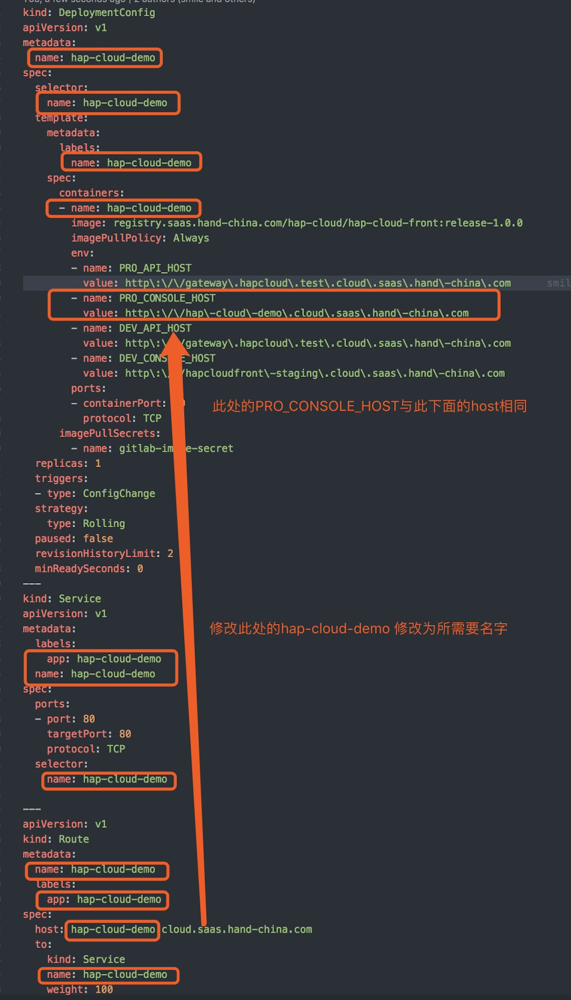
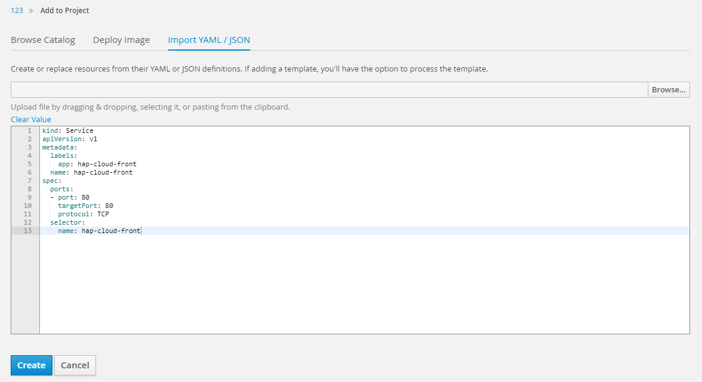

+++
title = "openshift部署"
date = "2017-10-30"
draft = false
weight = 4
+++

# openshift部署

## HAP Cloud 1.0部署
创建一个`hap-cloud-front.yml`文件,内容如下
```
kind: Deployment
apiVersion: extensions/v1beta1
metadata:
  name: hap-cloud-front
spec:
  template: 
    metadata:
      labels:
        name: hap-cloud-front
    spec:
      containers:
      - name: hap-cloud-front
        image: registry.saas.hand-china.com/hap-cloud/hap-cloud-front:release-1.0.0
        imagePullPolicy: Always
        env: 
        - name: PRO_API_HOST
          value: http\:\/\/hapcloud\.code\.saas\.hand\-china\.com
        - name: PRO_CONSOLE_HOST
          value: http\:\/\/hap\-cloud\-demo\.cloud\.saas\.hand\-china\.com
        - name: DEV_API_HOST
          value: http\:\/\/gateway\.hapcloud\.test\.cloud\.saas\.hand\-china\.com
        - name: DEV_CONSOLE_HOST
          value: http\:\/\/hapcloudfront\-staging\.cloud\.saas\.hand\-china\.com
        ports:
        - containerPort: 80
          protocol: TCP
      imagePullSecrets:
        - name: gitlab-image-secret
  replicas: 1
  paused: false 
  revisionHistoryLimit: 2
  minReadySeconds: 0
---
kind: Service
apiVersion: v1
metadata:
  labels:
    app: hap-cloud-front
  name: hap-cloud-front
spec:
  ports:
  - port: 80
    targetPort: 80
    protocol: TCP
  selector:
    name: hap-cloud-front
---
apiVersion: extensions/v1beta1
kind: Ingress
metadata:
  name: hap-cloud-front
  annotations:
    kubernetes.io/ingress.class: traefik
spec:
  rules:
  - host: hap-cloud-front.code.saas.hand-china.com
    http:
      paths:
      - backend:
          serviceName: hap-cloud-front
          servicePort: 80

```
在`hap-cloud-front.yml`中将`env`中`PRO_API_HOST`(后台服务器的host地址)和`PRO_CONSOLE_HOST`(前台显示的host地址)修改为相对应需要的地址

如果要修改前端host地址，需要修改一下name对应的值


登录项目或公司内部openshift,点击右上角`New Project`,写入项目名称，显示名称和描述之后点击`Create`

点击`Import YAML/JSON`
将刚编写的hap-cloud-front.yml文件从
```
king:Deployment
...
...
minReadySeconds:0
```
拷贝到输入框中并`create`


接着将之后的
```
kind: Service
...
spec
...
  selector:
    name: xxx
```
拷贝到输入框中并`create`


接着讲之后的
```
apiVersion: extensions/v1beta1
...
spec:
...
      backend:
      ...
        servicePort: 80
```
拷贝到输入框中并`create`

依次完成配置可以访问前端项目了

## HAP Cloud 1.1部署
创建一个`hap-cloud-front.yml`文件,内容如下
文件内容稍有变化
```
kind: Deployment
apiVersion: extensions/v1beta1
metadata:
  name: hap-cloud-front
spec:
  template: 
    metadata:
      labels:
        name: hap-cloud-front
    spec:
      containers:
      - name: hap-cloud-front
        image: registry.saas.hand-china.com/hap-cloud/hap-cloud-front:release-1.0.0
        imagePullPolicy: Always
        env: 
        - name: PRO_API_HOST
          value: http\:\/\/hapcloud\.code\.saas\.hand\-china\.com
        - name: PRO_CONSOLE_HOST
          value: http\:\/\/hap\-cloud\-demo\.cloud\.saas\.hand\-china\.com
        - name: DEV_API_HOST
          value: http\:\/\/gateway\.hapcloud\.test\.cloud\.saas\.hand\-china\.com
        - name: DEV_CONSOLE_HOST
          value: http\:\/\/hapcloudfront\-staging\.cloud\.saas\.hand\-china\.com
        ports:
        - containerPort: 80
          protocol: TCP
      imagePullSecrets:
        - name: gitlab-image-secret
  replicas: 1
  paused: false 
  revisionHistoryLimit: 2
  minReadySeconds: 0
---
kind: Service
apiVersion: v1
metadata:
  labels:
    app: hap-cloud-front
  name: hap-cloud-front
spec:
  ports:
  - port: 80
    targetPort: 80
    protocol: TCP
  selector:
    name: hap-cloud-front
---
apiVersion: extensions/v1beta1
kind: Ingress
metadata:
  name: hap-cloud-front
  annotations:
    kubernetes.io/ingress.class: traefik
spec:
  rules:
  - host: hap-cloud-front.code.saas.hand-china.com
    http:
      paths:
      - backend:
          serviceName: hap-cloud-front
          servicePort: 80

```
之后的操作见1.0部署

