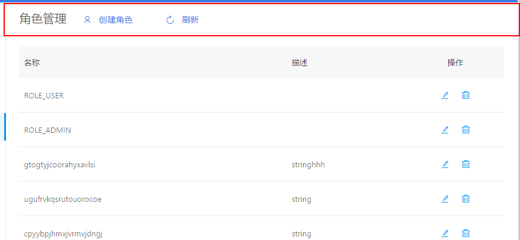

+++
title = "Pageheader"
date = "2017-10-26"
draft = false
weight= 10
+++

Pageheader
==========

框架目前界面的头部都是统一使用 PageHeader 渲染。

查询展示界面
------------

``` {.sourceCode .js}
<PageHeader title={HAP.languageChange("角色管理")}>
  <Button className="header-btn" ghost={true} onClick={this.openNewPage} style={PageHeadStyle.leftBtn} icon="user">{HAP.languageChange("创建角色")}</Button>
  <Button className="header-btn" ghost={true} onClick={() => { this.loadRoles(this.state.page) }} style={PageHeadStyle.leftBtn} icon="reload" >{HAP.languageChange("刷新")}</Button>
</PageHeader>
```



编辑新增界面
------------

``` {.sourceCode .js}
<PageHeader title={HAP.languageChange("创建角色")} backPath="/home/role" />
```


API
---

  参数          描述                     类型        默认值
  ------------- ------------------------ ----------- -----------
  title         页面的title（必须）      Object      无
  backPath      返回的页面的路径         String      无


