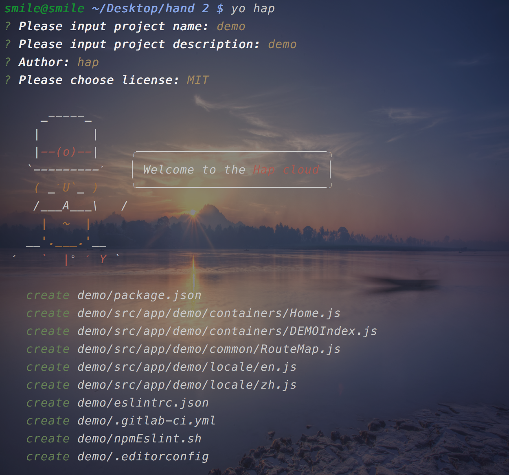
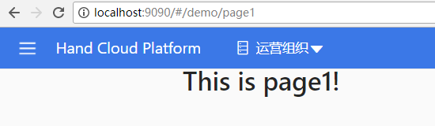

+++
title = "开发新模块"
date = "2017-10-26"
draft = false
weight= 2
+++

新建模块
========

新建模块
--------

切换到boot/generator-hap的目录下，运行 `npm link` 。

在与boot同级的目录，运行 `yo hap` ,则会出现需要输入和选择的信息.

**注意**: 在后面文档中,模块名默认输入的是demo, 如果输入的其他的模块名,
相应替换便可。

信息如图所示:

> 

此时会自动构建模块的结构，目录结构如图所示:

> 

然后进入到 `boot` 的目录下, 运行 `gulp` , 之后运行 `npm start` 启动项目,
在 `localhost:9090/#/demo` 便可以查看页面.

其中 `输入的模块名` + `Index` 文件是必须的，该文件的命名规则为
`模块名的大写` + `Index`
，如若模块名为test，则该文件应命名为TESTIndex.js，这是在gulp的配置文件中规定的。

新建或覆盖全局配置
------------------

在与boot同级的目录，运行 `yo hap:option` ,则会出现需要输入和选择的信息.

> 

生成的config文件

> 

生成的theme文件

> 

生成的server文件

> 

配置路由
========

在containers 目录中新建test\\Page1.js：

``` {.sourceCode .js}
import React from 'react';

const Page1 = () => (
    <div>
        <h1>This is page1!</h1>
    </div>
);
export default Page1;
```

在containers 目录中新建test\\Page1Index.js,配置Page1的访问路径：

``` {.sourceCode .js}
//Page1Index.js文件
import React from 'react';
import {
    Route,
    Switch
} from 'react-router-dom';
import asyncRouter from '../../../../util/asyncRouter';


const Page1 = asyncRouter(()=>(import('./Page1')));
const Page1Index=({ match })=>(
    <Switch>
        <Route exact path={match.url} component={Page1} />
    </Switch>
);

export default Page1Index;
```

在DEMOIndex.js文件,配置demo模块的路由：

``` {.sourceCode .js}
import React, {Component} from 'react';
import {
    Route,
    Switch
} from 'react-router-dom'

import asyncRouter from '../../../util/asyncRouter'

class DEMOIndex extends Component {
    render() {
        const Home = asyncRouter(() => import('./Home'));
        const Page1Index = asyncRouter(() => import('./test/Page1Index'));
        const {match} = this.props;
        return (
            <div>
                <Switch>
                    <Route exact path={match.url} component={Home}/>
                    <Route path={`${match.url}/page1`} component={Page1Index}/>
                </Switch>
            </div>
        )
    }
}
export default DEMOIndex;
```

查看效果
--------

在浏览器中键入 `http://localhost:9090/#/demo`


在浏览器中键入 `http://localhost:9090/#/demo/page1`



**提示**:
在新模块中开发新页面与前面在iam中开发新页面的规则和规范完全一致,可以参考iam中开发过程。

模块个性配置
============

配置主题
--------

进入项目根目录 打开config.js文件

``` {.sourceCode .js}
const config = {
"theme": true,
```

> } module.exports = config;

将theme设置为true 则允许修改主题色。

进入项目根目录 打开theme.js文件

``` {.sourceCode .js}
const theme = {
"antdTheme": {
  "primary-color": "red",
},
"header": "#3b78e7",
"menu": "red",
"backgroundColor": "white"
```

> } module.exports = theme;

`primary-color` : antd主题颜色

`header` : 头部颜色

`menu` : 左侧菜单颜色

`backgroundColor` : 背景色

头部项显示与隐藏
----------------

``` {.sourceCode .js}
const config = {
  "headerOrganzation": false
}
module.exports = config;
```

`headerOrganzation` :
如果为true，默认显示头部项，如果为false，头部项只有一个菜单，默认隐藏。

左部菜单栏
----------

``` {.sourceCode .js}
const config = {
  "menuCollapse": true,
}
module.exports = config;
```

`menuCollapse` :如果为true， 默认收起。如果为false，默认展开。

自定义全局样式
--------------

``` {.sourceCode .js}
const config = {
  "mainCss": JSON.stringify('iam'),
}
module.exports = config;
```

"mainCss": 设置该参数，将默认使用该值下的assets/css/main.less
里面的全局样式

配置服务器地址
--------------

在与boot同级的目录下创建 `server.js` 文件, 在文件编写内容如下:


第三方文件包安装
----------------

如果开发模块需要其他的第三方安装包,可以直接在模块中,通过
`npm i -D(-S) 包名` 来进行安装, 在部署集成时, 通过执行boot目录下的
`./npm.sh` 可以分别安装每个模块下所需要的所有文件。

权限管理
========

拿到当前用户在当前模块全部权限
------------------------------

``` {.sourceCode .js}
import { inject } from 'mobx-react';
@inject('AppState')
```

在当前模块引入AppState Store

``` {.sourceCode .js}
componentWillMount() {
  const { AppState } = this.props;
  const menuType = AppState.currentMenuType;
  const organizationId = menuType.id;
  const type = menuType.type;
  AppState.loadPerMission('hap-user-service.client', type, ['create', 'select', 'delete', 'update'], organizationId);
}
```

调用AppState.currentMenuType方法拿到当前所在组织信息
AppState.loadPerMission(data, type, permission, organid,
proid)方法有五个参数：

1.data: 哪个模块需要查询权限（一般为菜单路由的code字段）

2.type：当前组织或项目的类型（’organization' 或 'project')

3.permission: 增删改查权限数组

4.organizationId: 当前组织id

5.proid: 当前项目id(如果没有项目id可不填)


拿到的权限看起来是这样的。

调用权限
--------

``` {.sourceCode .js}
{HAP.getPermission(AppState.getPerMission, 'create') ? (<Button
          className="header-btn headLeftBtn"
          ghost
          onClick={() => {
            this.openNewPage();
          }}
          style={PageHeadStyle.leftBtn}
          icon="laptop"
        >{HAP.languageChange('create')}</Button>) : ''}
```

在调用权限的逻辑代码快，调用getPermission(data,
type)方法，通过返回的true或false判断当前有无操作权限。


