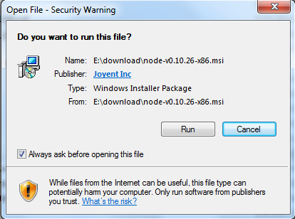
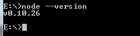

+++
title = "软件安装(Windows)"
date = "2017-02-01"
draft = false
weight= 1
+++

# 软件安装

## 安装工具

- Node.js 6.3及以上版本
- Webstorm 或其他代码编辑器
- Git

## node 安装

- 在 Node.js官网下载用于Windows平台的安装包
- Window 上安装Node.js，你可以采用以下两种方式来安装

### Windows 安装包(.msi)

本文实例以v0.10.26版本为例，其他版本类似，安装步骤：

步骤1 :双击下载后的安装包 **v0.10.26**，如下所示：



步骤2 :点击以上的Run(运行)，将出现如下界面：


步骤3 :勾选接受协议选项，点击next（下一步）按钮:


步骤4 : Node.js默认安装目录为“C:\Program Files\nodejs” ,你可以修改目录，并点击next（下一步）：


步骤5 :点击树形图标来选择你需要的安装模式,然后点击下一步next（下一步）


步骤6 :点击Install（安装）开始安装Node.js。你也可以点击Back（返回）来修改先前的配置。然后并点击next（下一步）：


安装过程：


点击Finish（完成）按钮退出安装向导。


检测PATH环境变量是否配置了Node.js，点击开始=》运行=》输入“cmd” =>输入命令“path”，输出如下结果：

```
PATH=C:\oraclexe\app\oracle\product\10.2.0\server\bin;C:\Windows\system32;

C:\Windows;C:\Windows\System32\Wbem;C:\Windows\System32\WindowsPowerShell\v1.0\;

c:\python32\python;C:\MinGW\bin;C:\ProgramFiles\GTK2-Runtime\lib;

C:\ProgramFiles\MySQL\MySQLServer5.5\bin;C:\ProgramFiles\nodejs\;

C:\Users\rg\AppData\Roaming\npm
```

我们可以看到环境变量中已经包含了C:\Program Files\nodejs\

检查Node.js版本



### Windows 二进制文件 (.exe)安装

步骤1 :双击下载的安装包Node.exe，将出现如下界面:


点击Run（运行）按钮将出现命令行窗口：


版本测试

进入node.exe所在的目录，如下所示：


如果你获得以上输出结果，说明你已经成功安装了Node.js。

## git 安装

1. 在Git 官网下载对应平台的 Git。
2. 本地执行安装文件， 安装 Git 环境。
3. Win 在环境变量中系统变量的 path 配置 Git 的环境变量指向 Git安装目录下的/bin。
4. 配置完成后打开 cmd 执行git，有提示则说明环境安装成功。

对于 Windows，安装 Git 以后，你可以在任意目录 右键，Git Bash Here

打开的 MINGW 命令窗口可以执行兼容 linux 系统的命令，如rm，ls等

## WebStorm或其他代码编辑器安装

1. 在 [WebStorm官网](http://www.jetbrains.com/webstorm/) 下载安装
2. 本地执行.exe文件，自行安装

## 开发准备

npm是Node.js的包管理工具（package manager）。npm可以根据依赖关系，把所有依赖的包都下载下来并管理起来。

npm已经在Node.js安装的时候顺带装好了。我们在命令提示符或者终端输入 `npm -v`，应该看到类似的输出：

```
C:\>npm -v
4.1.2
```

如果直接输入 `npm` ，你会看到类似下面的输出：

`C:\>npm Usage: npm <command> where <command> is one of:`

提示 `npm` 需要跟上命令。这样确保npm正确安装了，能运行就行。

## 全局安装 Webpack

我们希望能够在系统的任何文件夹中使用 Webpack，使用的方式是通过 Webpack 命令来完成的，这需要我们全局安装 Webpack。这也只需要安装一次，以后每个项目就不需要重新全局安装了。

```
$ npm install webpack -g
```

成功安装之后，你应该能够在任何目录中执行 webpack 命令，如果你还没有项目的配置文件的话，应该会看到当前的 Webpack 版本和一个命令的帮助列表。

## 全局安装 Gulp

在项目中，gulp 用于监视各模块文件的变化和同步相应的文件到boot目录中。

```
$ npm install gulp -g
```

安装成功后，在终端里运行 `gulp -v` 应该可以看到gulp的版本信息。

## 全局安装 yeoman

在项目中，yeoman 用于自动生成与boot同级的模块目录和文件。

```
$ npm install yeoman -g
```

若windows系统中安装失败.


可尝试运行。

```
$ npm -g install yo
```

安装成功后，在终端里运行 `yo --version` 应该可以看到yeoman的相关信息。

## 克隆代码

可以新建一个 `hap-cloud-front` 的目录，进入到该目录下，在终端执行

```
git clone https://xxxx@rdc.hand-china.com/gitlab/HAPCloud/HAPCloudFront.git --recursive
```

其中 `xxxx` 是你的工号。

(确保克隆之前设置了 `git config --global user.name git config --global user.email` )

- [git submodule 子模块操作](https://git-scm.com/book/zh/v1/Git-%E5%B7%A5%E5%85%B7-%E5%AD%90%E6%A8%A1%E5%9D%97)
- [git config 配置操作](https://git-scm.com/book/zh/v1/%E8%87%AA%E5%AE%9A%E4%B9%89-Git-%E9%85%8D%E7%BD%AE-Git)

## 运行代码

进入到项目boot目录下,右键`git bash here`, 执行`npm run preinstall`,成功之后在该目录下继续执行`npm install`。

安装依赖完成后，执行`node_modules/.bin/gulp`,如果已全局安装gulp,则可直接执行gulp

不要关闭该终端(在iam等其他模块项目中源文件发生修改时，gulp会自动检测修改并同步)，新开一个`git bash`同样在该目录下执行 `npm start` 启动项目，看到如图所示效果说明启动成功


提示: (可以通过 `gulp clean` 删除所有自动生成的文件,再通过 `gulp` 来重新生成，再重新启动 `npm start` ，这样可以解决有时页面未更新的状态)

## 查看效果

在浏览器中键入 `localhost:9090/`