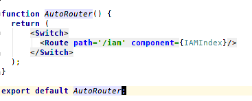

+++
title = "开发新页面"
date = "2017-02-01"
draft = false
weight= 1
+++

# 开发新页面

## 新建文件夹

在 \iam\src\app\iam\containers\organization目录下新建一个新的功能文件夹\demo及其相关的JS文件：


```
// Demo.js文件
import React, { Component } from 'react';
import { withRouter } from 'react-router-dom';

class Demo extends Component {
  render() {
    return (
      <div>{'Hello, it\'s a demo!'}</div>
    );
  }
}
export default withRouter(Demo);
```

```
// DemoIndex.js文件
import React from 'react';
import {
  Route,
  Switch,
} from 'react-router-dom';
import asyncRouter from '../../../../../util/asyncRouter';

const Demo = asyncRouter(()=>import('./Demo'));

const DemoIndex = ({ match }) => (
  <Switch>
    <Route exact path={match.url} component={Demo} />
  </Switch>
);

export default DemoIndex;
```

## 配置路由

在\iam\src\app\iam\containers\IAMIndex.js文件中配置新建文件的访问路径：

```
...
//异步路由
const DemoIndex = asyncRouter(()=>import('./organization/demo/DemoIndex'));
...
              <Route path={`${match.url}/demo`} component={DemoIndex} />
...
```

> 注意： 本次demo的访问路径应该为： `/iam/demo` ，因为在gulp自动生成路由配置时，IAMIndex的路由被映射为iam



配置完路由信息后就可以使用url访问刚刚新建的文件了。


## 获取后台数据

文件可以被访问后，接下来就是完善界面信息，从后台获取数据。获取数据的方法都写在和文件对应的store文件中。

### axios()函数

axios()可以设置全局的配置，例如请求头信息，拦截器等，这样的好处是可以避免重复配置。 常用方法：

- axios.request(config)
- axios.get(url[, config])
- axios.delete(url[, config])
- axios.head(url[, config])
- axios.post(url[, data[, config]])
- axios.put(url[, data[, config]])
- axios.patch(url[, data[, config]])

```
// store/organization/demo/DemoStore.js文件

import { observable, action, computed } from 'mobx';
// 该axios是封装过的，设置了请求头信息和响应拦截器
import axios from 'Axios';
import store from 'Store';

// store注解符令组件可以通过DemoStore来找到该store
@store('DemoStore')
class DemoStore {
  @observable roles = [];

  @computed get getRoles() {
    return this.roles.slice();
  }

  @action setRoles(data) {
    this.roles = data;
  }

  loadRole() {
    axios.get('uaa/v1/roles?page=0&size=100').then((data) => {
      if (data) {
        this.setRoles(data.content);
      }
    });
  }
}

const demoStore = new DemoStore();

export default demoStore;
```

更多关于axios()的相关信息可以参考：[https://www.npmjs.com/package/axios](https://www.npmjs.com/package/axios)

## 前端数据渲染

拿到后台数据后就可以将数据渲染到界面了，下面将介绍如何将数据渲染到前端界面：

### 加载DemoStore

修改\iam\src\app\iam\containers\organization\demo\DemoIndex.js，添加添加异步加载DemoStore：

```
// DemoIndex.js文件
import React from 'react';
import {
  Route,
  Switch,
} from 'react-router-dom';
import asyncRouter from '../../../../../util/asyncRouter';
// DemoIndex.js文件中异步加载DemoStore
const Demo = asyncRouter(() => import('./Demo'), () => import('../../../stores/organization/demo/DemoStore'));

const DemoIndex = ({ match }) => (
  <Switch>
    <Route exact path={match.url} component={Demo} />
  </Switch>
);

export default DemoIndex;
```

### 获取数据并渲染

在 react 的状态处理函数 `componentDidMount()` 中调用 `loadRoles` 函数获取数据，此时才真正拿到后台的数据。数据被存储在了组件的 `props.DemoStore.roles` 中。我们可以在 `render()` 中（或者在任何 `componentDidMount()` 函数之后执行的函数中）查看拿到的数据：`console.log(this.props.DemoStore.getRoles())`。

```
componentDidMount(){
  this.props.DemoStore.loadRoles();
}
```

更多关于react的信息可以参考： [https://hulufei.gitbooks.io/react-tutorial/content/introduction.html](https://hulufei.gitbooks.io/react-tutorial/content/introduction.html)

最终的demo界面源码如下：

```
import React, { Component } from 'react';
import { Table } from 'antd';
import { observer } from 'mobx-react';
import { withRouter } from 'react-router-dom';

@observer
class Demo extends Component {
  componentDidMount() {
    this.props.DemoStore.loadRole();
  }

  render() {
    const columns = [{
      title: HAP.languageChange('role.name'),
      dataIndex: 'name',
      key: 'name',
    }, {
      title: HAP.languageChange('role.level'),
      dataIndex: 'roleLevel',
      key: 'roleLevel',
    }, {
      title: HAP.languageChange('role.description'),
      dataIndex: 'description',
      key: 'description',
    }, {
      title: HAP.languageChange('role.serviceName'),
      dataIndex: 'serviceName',
      key: 'serviceName',
    }];
    return (
      <div style={{ margin: 20 }}>
        <Table
          columns={columns}
          dataSource={this.props.DemoStore.getRoles}
          pagination="true"
          rowKey={
            function func(record) {
              const rec = record.id;
              return rec;
            }
          }
        />
      </div>
    );
  }
}
// withRouter添加history支持
export default withRouter(Demo);
```

