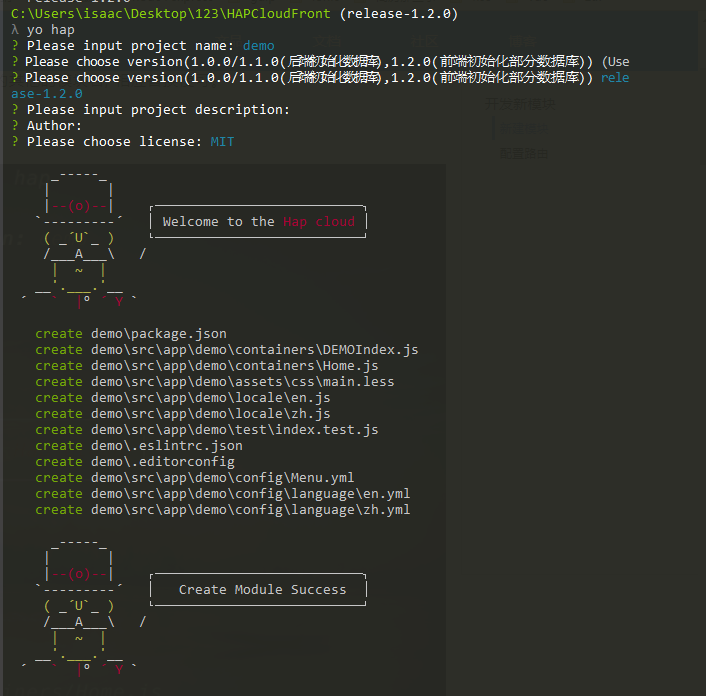

+++
title = "开发新模块"
date = "2017-02-01"
draft = false
weight= 2
+++

# 开发新模块

## 新建模块

###  新建模块

切换到boot/generator-hap的目录下，运行 `npm link` 。

在项目根目录，运行 `yo hap` ,则会出现需要输入和选择的信息.

注意: 在后面文档中,模块名默认输入的是demo, 如果输入的其他的模块名, 相应替换便可。

信息如图所示:



此时会自动构建模块的结构，目录结构如图所示:


然后进入到 `boot` 的目录下, 运行 `gulp` , 之后运行 `npm start` 启动项目, 在 `localhost:9090/#/demo` 便可以查看页面.

其中 `输入的模块名` + `Index` 文件是必须的，该文件的命名规则为 `模块名的大写` + `Index` ，如若模块名为test，则该文件应命名为TESTIndex.js，这是在gulp的配置文件中规定的。

## 配置路由

在containers 目录中新建test\Page1.js：

```
import React from 'react';

const Page1 = () => (
    <div>
        <h1>This is page1!</h1>
    </div>
);
export default Page1;
```

在containers 目录中新建test\Page1Index.js,配置Page1的访问路径：

```
//Page1Index.js文件
import React from 'react';
import {
    Route,
    Switch
} from 'react-router-dom';
import asyncRouter from '../../../../util/asyncRouter';


const Page1 = asyncRouter(()=>(import('./Page1')));
const Page1Index=({ match })=>(
    <Switch>
        <Route exact path={match.url} component={Page1} />
    </Switch>
);

export default Page1Index;
```

在DEMOIndex.js文件,配置demo模块的路由：

```
import React, {Component} from 'react';
import {
    Route,
    Switch
} from 'react-router-dom'

import asyncRouter from '../../../util/asyncRouter'

class DEMOIndex extends Component {
    render() {
        const Home = asyncRouter(() => import('./Home'));
        const Page1Index = asyncRouter(() => import('./test/Page1Index'));
        const {match} = this.props;
        return (
            <div>
                <Switch>
                    <Route exact path={match.url} component={Home}/>
                    <Route path={`${match.url}/page1`} component={Page1Index}/>
                </Switch>
            </div>
        )
    }
}
export default DEMOIndex;
```

### 查看效果

在浏览器中键入 `http://localhost:9090/#/demo`


在浏览器中键入 `http://localhost:9090/#/demo/page1`


> 提示: 在新模块中开发新页面与前面在iam中开发新页面的规则和规范完全一致,可以参考iam中开发过程。

### 第三方文件包安装

如果开发模块需要其他的第三方安装包,可以直接添加在模块`package.json`文件, 在部署集成时, 通过执行boot目录下的 `npm run preinstall` 可以将各个子模块package.json文件合并到boot的package.json文件中,再执行`npm install`安装项目依赖。
