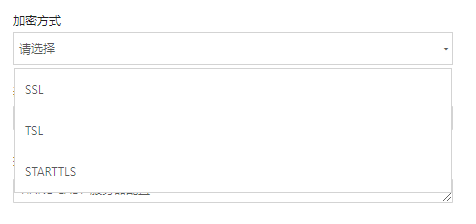

+++
title = "Select"
date = "2017-02-01"
draft = false
weight= 12
+++

# Select 下拉选择组件

## 用途
Select组件为封装的框架统一下拉选择组件，通过统一，简便的配置完成下拉选择功能。



## 用法
在组件头部引用后直接调用
```
...
import Select from 'Select'
...
handleSelectChange = (value) => {
  this.setState({ value })
}
...
return (
  <Select
    data={[{
      code: 'SSL',
      name: 'SSL',
    }, {
      code: 'TSL',
      name: 'TSL',
    }]}
    onChange={this.handleSelectChange.bind(this)}
    type
    default={LDAPStore.ldapData.encryption}
  />
)
...
```

参数 | 说明
--- | ---
data | 下拉菜单的数据，`code`为对应的字段,`name`为对应的文字
onChange | 下拉列表选中事件 回调函数默认带一个参数为选中的`code`
type | `可选`长下拉框
typ2 | `可选`短下拉框
width | `可选`下拉框长度
default | 默认显示文字