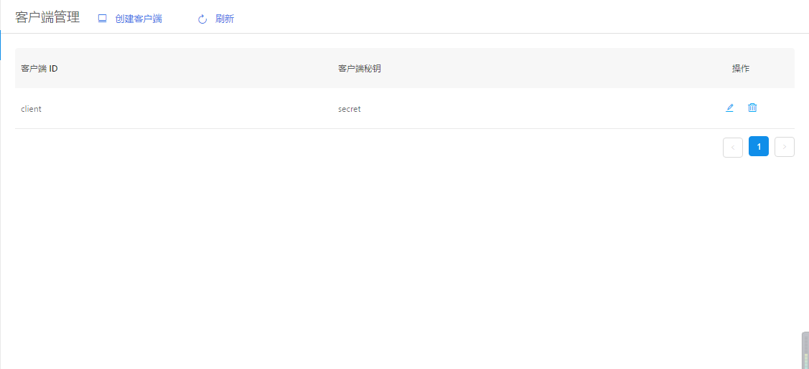
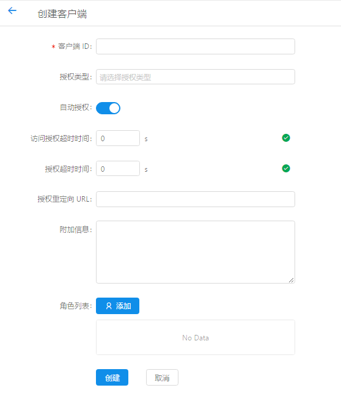
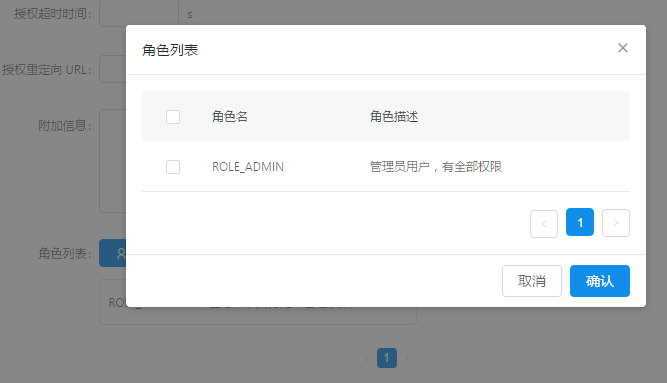
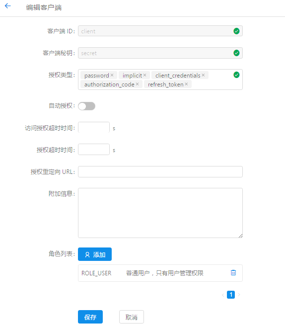

+++
title = "客户端管理"
date = "2017-02-01"
draft = false
weight = 2
+++

# 客户端管理

用于管理员用户创建管理新的客户端给其他人开发使用。

## 功能描述

管理云平台客户端。如下图所示。

客户端列表给出ID、秘钥字段信息。

## 创建客户端

1. 创建新的客户端，填入相关信息，对客户端的相关字段进行自定义配置
2. 点击角色列表添加Button，弹出角色列表,选择客户端角色
3. 输入无误，点击创建即可新建客户端

> - 客户端在某种授权模式下不通过用户来访问，则需要给客户端设置角色以便其权限管理
> - 已添加角色在弹出的角色列表不再显示
> - 角色列表内角色信息增删查改等操作请查看角色管理说明

## 编辑客户端

点击列表操作图标，详细查看和编辑对应客户端信息

1. 对表单信息进行修改确认无误后，点击保存即可更新当前编辑客户端信息
2. 点击取消返回客户端管理界面，信息无修改

## 字段说明

- 客户端ID: 客户端的唯一标识，默认是有意义的英文单词，不含空格
- 客户端秘钥：后台生成的随机秘钥，用于用户获取token
- 授权类型: 支持授权的模式
- 自动授权：自动同意授权，不选中则需用户手动同意授权，一般自己第三方应用的客户端不选中
- 访问授权超时时间：登陆后的用户Token多长时间自动失效，一般默认留空
- 授权超时时间： 登陆后的用户RefreshToken多长时间自动失效，一般默认留空
- 授权重定向 URL: 使用授权码模式，简化模式时的回调URL验证，防止别人盗用client
- 附加信息: 按需添加客户端的附加信息