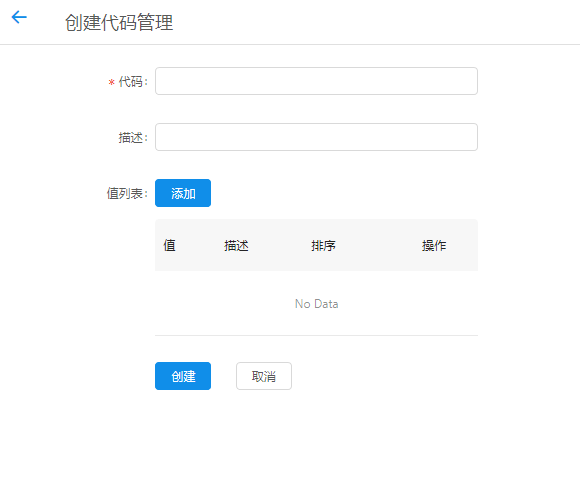
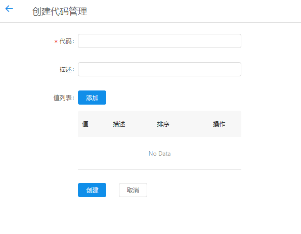
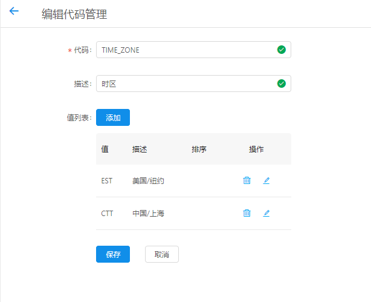
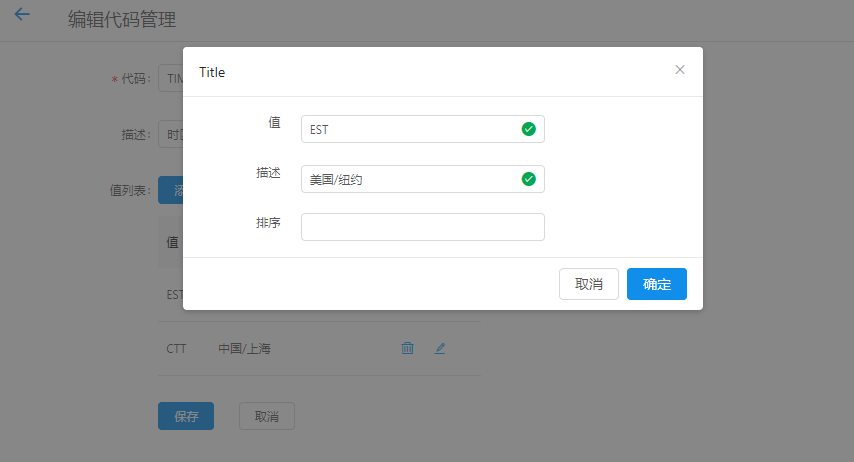

+++
title = "代码管理"
date = "2017-02-01"
draft = false
weight = 8
+++

# 代码管理

## 功能描述

管理云平台系统常量表,如下图所示:

列表显示代码常量和其描述

> 具体实例查看表中时区常量管理

## 创建代码管理

1. 创建代码常量管理，填入相关信息
2. 点击值列表添加Button，输入新添的值（必填）及其描述、排序
3. 输入，添加无误，点击创建即可代码常量管理

## 编辑代码管理

点击列表操作图标，详细查看和编辑对应信息。

1. 可对代码、描述进行编辑修改
2. 编辑修改值列表
3. 编辑修改无误，点击保存即可更新信息
