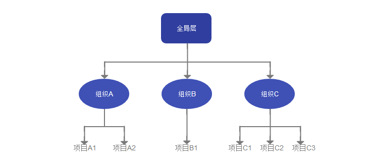

+++
title = "全局层功能"
description = ""
weight = 2
+++

# 全局层

全局层是系统的最高层次，用于管理整个系统的配置。组织是与项目有关的最高层次，而组织之间的统一管理无法在单一组织中完成，因此需要一个与层级高于组织层，这个层级就是全局层。在全局层的操作，自上而下作用于系统-组织-项目。

在全局层中，可进行角色管理、全局层角色分配、菜单配置等功能。因为服务、权限、角色、菜单都是可作用于所有组织而不只是单一组织，它们作用于整个系统。服务是平台所能提供的功能。权限是是否能使用这些功能，具有层级性。角色是一组特定权限的集合，因此它也具有层级性，不同层级的角色只能在不同层级可供选择。全局层的角色分配中，只能给用户分配全局层的角色。菜单是系统左侧菜单栏的配置和展示，具有层级性，不同层级的菜单栏是不同的。

**全局层的功能：**

- [服务](#1)
- [权限](#2)
- [角色](#3)
- [角色分配](#4)
- [菜单配置](#5)

**进入方式：**

选中顶部导航栏的【管理】选项，即可进入全局层

