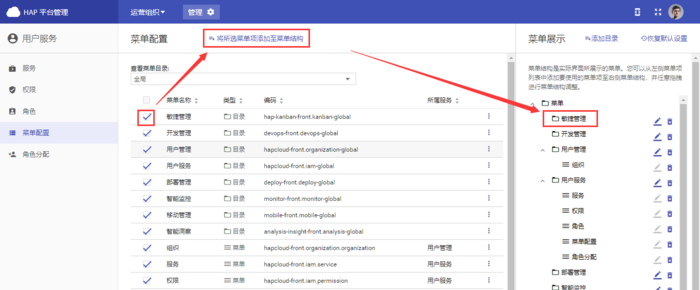
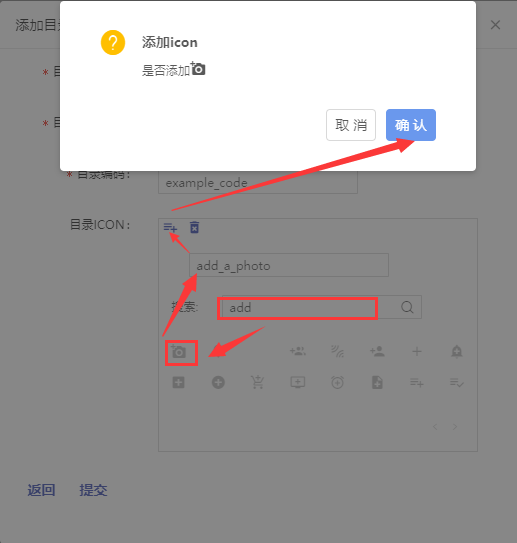
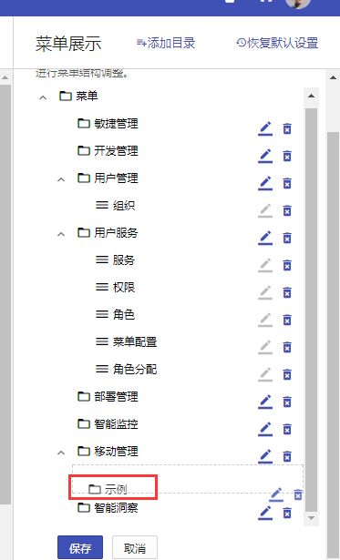
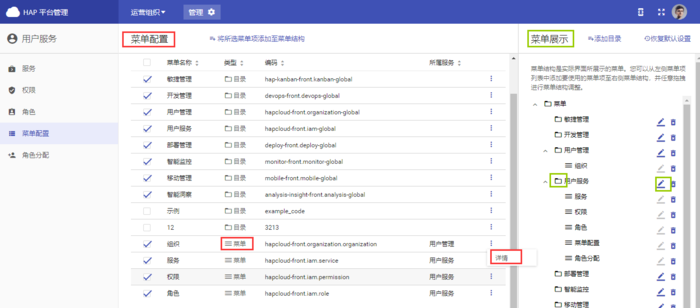

+++
title = "菜单配置"
weight = 5
+++

# 菜单配置

菜单配置用于配置系统界面左侧菜单栏。里面分**菜单配置**和**菜单展示**两个子界面。**菜单配置**用于存放系统中所有菜单项；**菜单展示**直接与系统左侧菜单栏的显示相关联，可取菜单配置中存放的菜单项展示，可调整展示顺序，保存后**菜单展示**里的菜单项及其顺序就是系统左侧菜单所展示的。

**功能：**

- [菜单配置](#1)
- [添加目录](#2)
- [其他操作](#3)

<h2 id="1">菜单配置</h2>

1. 层级选择：通过选择层级，来查看、配置不同层级（全局层/组织层/项目层）的菜单栏
1. 勾选要添加到菜单栏的目录/菜单
1. 点击[将所选菜单项添加至菜单结构]
1. 在菜单展示页将出现刚刚添加的目录/菜单，可拖动进行位置顺序调节

<h2 id="2">添加目录</h2>

**必填项：**

- 目录中文名称
- 目录英文名称
- 目录编码

**选填项：**

- 目录ICON（目录图标）
    
    1. 在搜索栏，输入图标名称进行搜索
    1. 鼠标悬停在图标上，显示图标全称
    1. 在添加栏，输入图标全称
    1. 点击添加按钮
    1. 弹出弹窗，点击确认
    1. 创建目录成功后，该目录在菜单配置页和菜单展示页底部
    1. 长按鼠标右键，可对该目录进行位置拖动

    

    

> 注意：
> 1. 只有目录下有菜单时，该目录才在菜单栏显示；否则该目录在菜单栏不显示 
> 1. 确认要更改在某一层级（全局/组织/项目）的菜单项后，不要忘记在**菜单展示**左下角点击**保存**，否则切换层级后，之前的更改操作无效

    

<h2 id="3">其他操作</h2>

- **删除：**目录可删除，菜单不可删除
- **详情：**在菜单配置页可查看菜单详情（目录不可）
- **编辑：**在菜单展示页可编辑目录（菜单不可）

