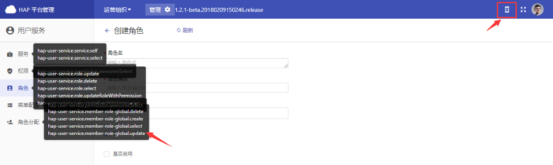
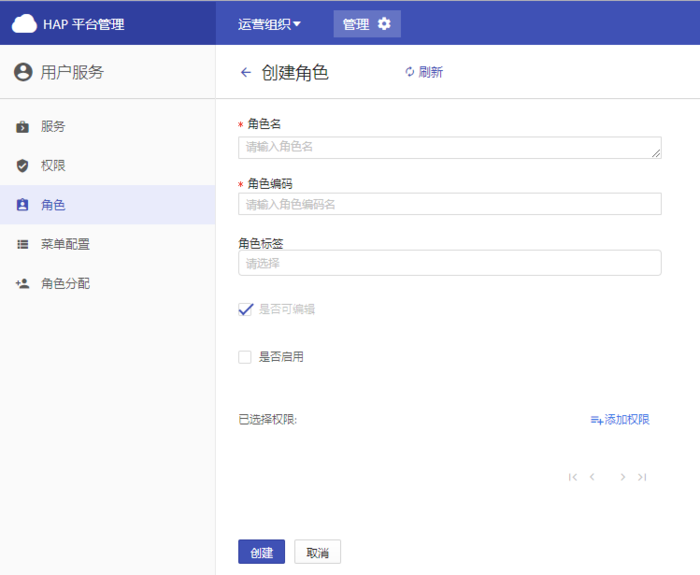

+++
title = "角色"
weight = 3
+++

# 角色

角色是一组特定权限的集合。以便给用户分配权限时不用选中无数个权限，而是选角色即可，极大简化了权限分配的操作。权限具有层级性，所以角色也具有层级性。给一个角色分配全局层权限后，则不能分配组织层、项目层的权限，这个角色为全局层角色；给一个角色分配组织层/项目层权限后，则不能分配全局层权限，这个角色为组织层/项目层角色。

**功能：**

- [创建角色](#1)
- [根据所选角色创建](#2)
- [其他操作](#3)

<h2 id="1">创建角色</h2>

**必填项：**

- 角色名：角色创建成功并启用后，可在角色分配（与角色权限相对应的层级）的自定义角色中，根据角色名选择

- 角色编码：
    - 具有唯一性
    - 用于与Git Lab角色关联

- 权限：全局层与组织层/项目层不可共存，组织层与项目层权限可共存。选择权限时，如果对于功能所需的权限不清楚，可以使用导航栏右上角的调试功能来查看

**选填项：**

- 角色标签：实现不同系统之间角色的映射
    - 角色标签选项是针对GItLab或其他平台的角色灵活变更
    - 角色标签的选项不是固定的，可根据对应的其他平台进行设置，角色标签代表的是与其他平台角色关联关系

- 是否可编辑：目前不可选，所有新建的角色都默认勾选可编辑

- 是否启用：勾选后，角色可以被应用到角色分配中

<h2 id="2">根据所选角色创建</h2>

- **操作：**勾选要被继承的角色后，选中【根据所选角色创建】
- **结果：**新建的角色将继承被选角色的权限

<h2 id="3">其他操作</h2>

- **删除：**如果为内置角色，不可删除；不为内置角色，可删除
- **详情：**可查看创建角色时的信息
- **编辑：**如果是从后台数据库导入的角色，则不可编辑；前端创建的角色默认都可编辑
- **启用/停用：**停用角色后，角色信息依然存在，但在分配角色时无该角色选项

