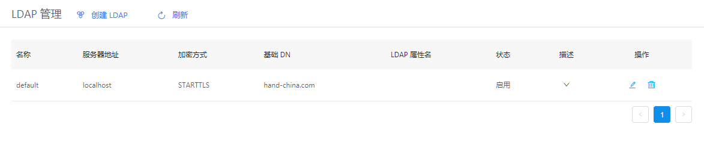
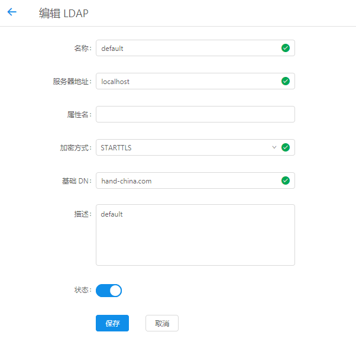

+++
title = "LDAP管理"
date = "2017-02-01"
draft = false
weight = 6
+++

# LDAP 管理

## 功能描述

管理云平台 LDAP，如下图所示。:

列表给出名称、服务器地址、加密方式、基础DN、LDAP属性名、状态、描述等字段信息。

> 支持使用LDAP进行授权，需要先拥有对应用户。在这个页面对LDAP进行配置，并在组织管理界面分配给组织。

## 创建 LDAP

1. 创建新 LDAP，填入相关信息
2. 输入无误，点击创建即可新建LDAP

### 编辑 LDAP

1. 点击列表操作图标，详细查看和编辑对应信息。
2. 对表单信息进行修改确认无误后，点击保存即可更新当前编辑LDAP信息
3. 点击取消返回管理界面，信息无修改

### 字段说明

- 名称：LDAP配置的名称，用于标识
- 服务器地址： LDAP服务器地址
- 属性名： LDAP属性名
- 加密方式： LDAP服务加密方式
- 基础DN： LDAP基础DN
- 描述： LDAP的描述
- 状态： LDAP是否启用