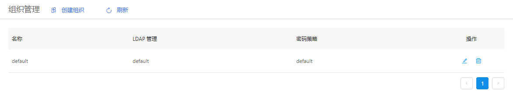
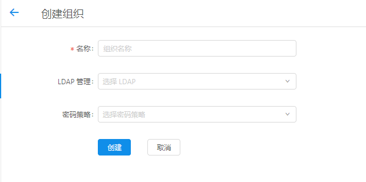
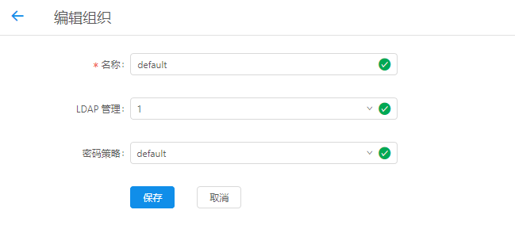

+++
title = "组织管理"
date = "2017-02-01"
draft = false
weight = 4
+++

# 组织管理

## 功能描述

管理云平台用户组织，如下图所示：

列表给出组织名称、LDAP管理、密码策略字段信息。

> - 组织管理包含LDAP管理以及密码策略。
> - 创建组织便于给属于该组织的用户统一适用LDAP管理以及密码策略

## 创建组织

1. 创建新组织，选择相关信息
2. 选择无误，点击创建即可新建

## 编辑组织

1. 点击列表操作图标，详细查看和编辑对应组织信息。
2. 对表单信息进行修改确认无误后，点击保存即可更新当前编辑组织信息
3. 点击取消返回管理界面，信息无修改 

## 字段说明

名称：组织的唯一标识，默认是有意义的英文单词，不含空格

> - 有关密码策略信息请查看密码策略章节
> - LDAP管理信息请查看LDAP管理章节