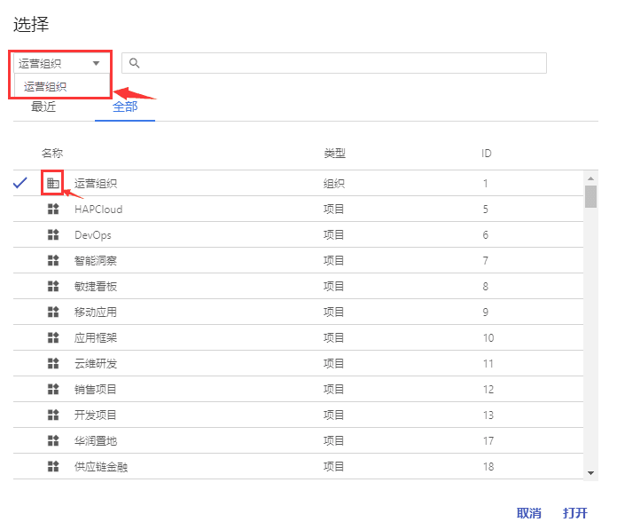

+++
title = "组织层功能"
description = ""
weight = 3
+++

# 组织层

组织层是与项目有关的最高层次，对一个组织的操作，影响范围为该组织与属于该组织的项目，不影响其他组织。因为需要对某些项目进行统一操作，所有要有高于项目层一层的层级，这个层为组织层。

在组织层，可以进行用户管理、项目管理、用户组管理、客户端管理、LDAP管理、密码策略管理和角色分配。在某一特定组织下创建的用户、项目、用户组属于这个组织，且LDAP、密码策略只作用于该组织而不作用于其他组织。用户管理是对该组织下用户个人信息与登陆账号的管理。项目管理是对该组织下的项目信息、项目应用的管理，而不进行项目成员的管理（该功能在项目层）。用户组管理是对用户组信息、用户组成员的管理，将用户分组，是为了便于DevOps里的灰度部署，特定用户组里的用户能访问与用户组外用户的不同的网关。客户端管理是对多个客户端信息设置的管理。配置文件中应用指定的客户端后，登录后跳转页面指向的该客户端设定的网址。LDAP管理是对组织应用的LDAP信息设置的管理。LDAP只针对LDAP用户，LDAP用户的登陆名和密码取自LDAP指向的外部系统中的数据。密码策略是对组织应用的密码安全策略和登陆安全策略的信息设置的管理。当应用密码安全策略时，同组织下用户的密码设定和修改都要遵守该密码规则；当应用登陆安全策略时，同组织下用户登陆系统时的密码输入情况要遵守该登陆规则。在组织层的角色分配中，不能给用户分配全局层角色，即用户没有作用于全局层的功能权限，只有作用于组织层和项目层的功能权限。

**进入方式：**

- 选中顶部导航栏的【组织/项目】选项

- 弹出组织/项目列表的弹窗
    - 在下拉菜单中选择一个组织，组织/项目列表则变为被选组织与该组织下的所有项目
    - 鼠标右键双击组织/项目列表的第一项-组织项，则进入该组织

**组织层的功能：**

- [用户](#1)
- [项目](#2)
- [用户组](#3)
- [角色分配](#4)
- [客户端](#5)
- [LDAP](#6)
- [密码策略](#7)
