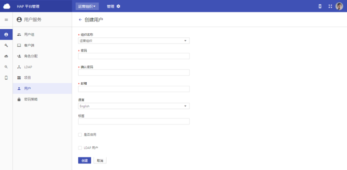

+++
title = "用户"
weight = 1
+++

# 用户

用户管理，即对用户个人信息和用户登陆情况的管理。

**功能：**

- [创建用户](#1)
- [其他操作](#2)

<h2 id="1">创建用户</h2>

**必填项：**

- 用户名：
    - 具有唯一性
    - 可用于登陆，角色分配
    
- 昵称：
    - 用户的别名
    - 例如，‘张三’在公司的工号为‘01’，可将这个用户的用户名设为‘01’，因为具有唯一性，用于登陆，这个用户的昵称则可设为‘张三’，便于识别

- 组织名称：
    - 用户所在的组织
    - 当前默认所有用户都属于运营组织

- 密码、确认密码：
    - 用户登陆系统所需的密码
    - 两次密码输入要一致
    - 密码的设置要符合密码策略
    - 当用户是LDAP用户时，前端设置的密码无效

- 邮箱：
    - 具有唯一性
    - 用户要填写真实有效的邮箱
    - 邮箱可用于登陆、找回密码

**选填项：**

- 语言:默认为English
- 是否启用：未启用用户时，用户为未激活状态，不可登陆系统
- 是否为LDAP用户（使用公司统一认证登陆密码进行登陆）：为LDAP用户时，密码为公司系统中存储的密码，在页面前端填入的密码无效；用户本人修改密码时，只能通过公司系统修改，在平台前端修改无效，且不能在平台使用忘记密码功能

<h2 id="2">其他操作</h2>

- **详情：**查看用户创建时所填信息

- **编辑：**更改用户信息，信息更改无误后，点击’保存’生效

- **删除：**删除用户数据

- **搜索：**
    - 不选择属性，根据输入值进行全局搜索
    - 选择一个属性：用户名、昵称、认证来源（LDAP用户/非LDAP用户）、语言、是否启用（启用/未启用）、是否锁住（锁住/未锁住），输入相应的属性值进行搜索

- **启用/停用：**
    - 启用时，用户状态为启用，可登陆平台进行权限内的操作
    - 停用时，用户状态为未启用，用户变为未激活状态，无法登陆系统

- **解锁：**
    - 当用户多次输错密码被锁住无法登陆时，则出现解锁选项
    - 解锁后该用户则可登陆平台进行操作

