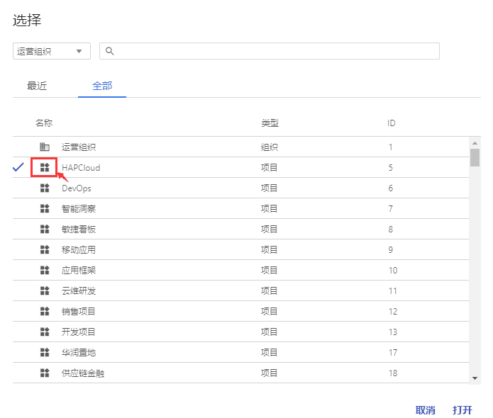

+++
title = "项目层功能"
description = ""
weight = 4
+++

# 项目层

项目层是用于连接组织，管理一个特定项目的层级，对一个项目后操作只对该项目生效，不影响其他项目。项目层具有管理属于项目的成员以及成员在项目中的角色的功能。在项目层的角色分配中，只能给用户分配项目层的角色，即用户只有作用于项目层的功能权限，且用户在被分配项目层的角色后，则属于该项目的成员。

**进入方式：**

- 选中顶部导航栏的【组织/项目】选项

- 弹出组织/项目列表的弹窗
    - 在下拉菜单中选择一个组织，组织/项目列表则变为被选组织与该组织下的所有项目
    - 项目过多时，可在搜索框中对项目名进行模糊搜索
    - 鼠标右键双击组织/项目列表的项目选项，则进入该项目

    
**项目层的功能：**

- [角色分配](#1)