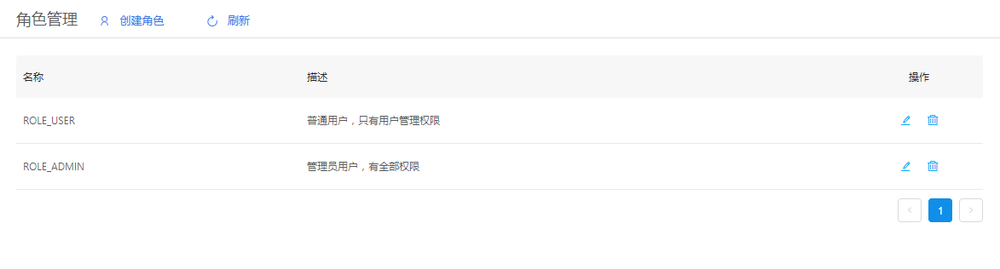
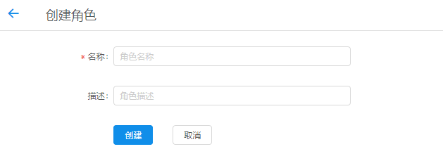
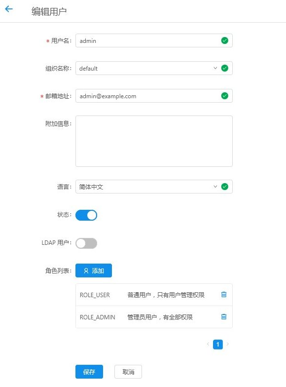

+++
title = "角色管理"
date = "2017-02-01"
draft = false
weight = 5
+++

# 角色管理

## 功能描述

管理云平台用户角色，如下图所示：

角色列表给出名称、描述等字段信息。

> 创建角色用于给角色分配功能权限，再给用户或客户端分配角色

## 创建角色

1. 创建新的角色，填入相关信息
2. 输入无误，点击创建即可新建角色

## 编辑角色

1. 点击列表操作图标，详细查看和编辑对应角色信息。
2. 对表单信息进行修改确认无误后，点击保存即可更新当前编辑角色信息
3. 点击取消返回管理界面，信息无修改

## 字段说明

- 名称：角色的唯一标识，默认是有意义的英文单词，不含空格
- 描述：对该角色功能权限的描述或其他自定义描述
