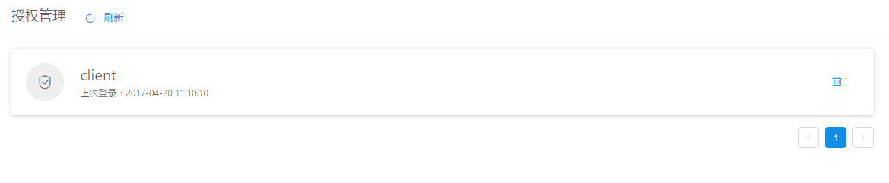

+++
title = "授权管理"
date = "2017-02-01"
draft = false
weight = 7
+++

# 授权管理

## 功能描述

云平台客户端授权状态信息，如下图所示:

> - 显示当前客户端授权状态信息
> - 删除Token后当前用户的目标客户端的Token失效，但是如果授权服务器的会话还在，可以重新从授权服务器直接获取Token，而不需要输入账号密码
