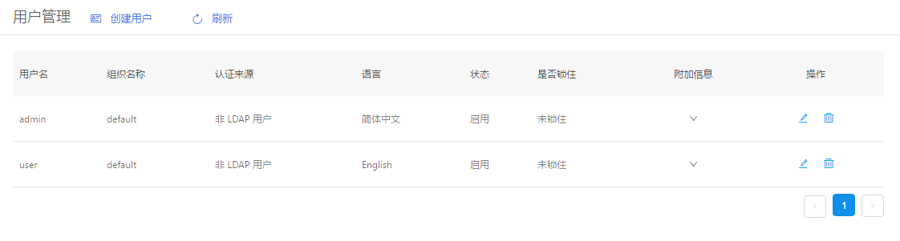
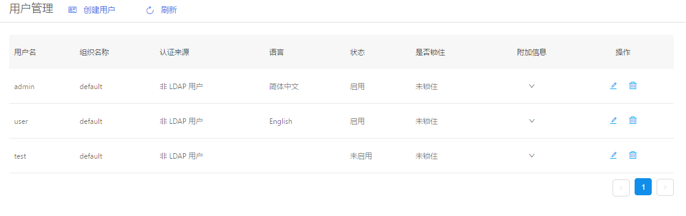
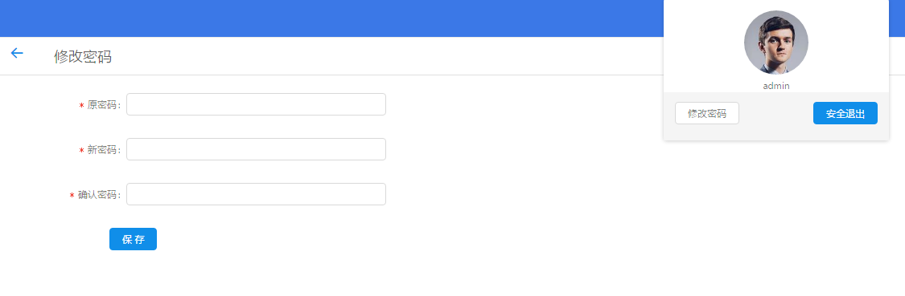

+++
title = "用户管理"
date = "2017-02-01"
draft = false
weight = 3
+++

# 用户管理

## 功能描述

管理云平台用户,如下图所示:

列表给出用户名、组织名称、认证来源、语言、状态、是否锁住、附加信息等字段信息。

## 创建用户
创建新用户有两种方案，如下：

### 管理员创建新用户

1. 创建新用户，填入相关信息
2. 点击角色列表添加Button，弹出角色列表,选择用户具备的角色
3. 输入无误，点击创建即可新建用户

>- 用户具备的功能权限由用户所扮演的所有角色的功能并集所决定
>- 角色列表内角色信息增删查改等请查看角色管理说明

### 注册创建新用户

1. 完成表单输入，点击注册即可创建新用户
2. 初注册用户状态为未启用，也不具备功能权限

> 注册创建新用户无法直接登录系统，需要管理员为该用户分配角色具备功能权限并状态启用才可使用

## 用户密码修改

1. 点击右上角头像，显示用户信息并可进行修改密码及安全退出操作
2. 完成修改密码界面信息输入，点击保存即可修改当前用户登录密码

## 编辑用户

1. 点击列表操作图标，详细查看和编辑对应用户信息。
2. 对表单信息进行修改确认无误后，点击保存即可更新当前编辑用户信息
3. 点击取消返回管理界面，信息无修改

## 字段说明

- 用户名：用户的唯一标识，默认是有意义的英文单词，不含空格
- 组织名称：用户所属组织
- 邮箱地址：用户邮箱
- 附加信息：自定义 json 格式的附加信息
- 语言：用户使用平台的语言设置
- 状态：是否启用当前用户
- LDAP用户：是否具备LDAP管理权限

>- 有关用户组织详细信息请查看组织管理章节
>- LDAP管理信息请查看LDAP管理章节