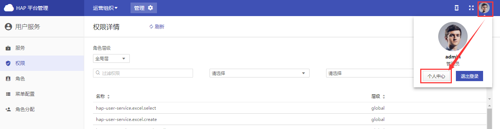

+++
title = "用户层功能"
description = ""
weight = 5
+++

# 用户层

用户层是仅包含用户个人的层级，在用户层，用户操作自己的数据时不影响其他用户信息。用户层是为了用户能管理个人信息。

**进入方式：**

选中顶部导航栏的右上角头像，点击【个人中心】，即可进入用户层

**用户层的功能：**

- [用户信息维护](#1)
- [密码更改](#2)
- [授权](#3)