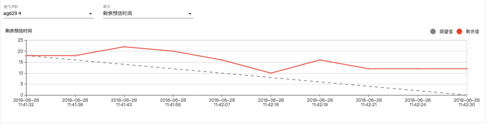

查看敏捷报告

1、燃尽图：

用于跟踪记录所有问题的剩余工作工作时间，预估完成冲刺任务的可能性，回顾总结迭代过程中的经验与不足。
进入到`报告`菜单，选择燃尽图报告

- 横坐标代表时间
- 纵坐标代表统计值
 
日志信息

- 日期：表示活动日志记录时间 
- 问题：活动日志记录的问题编号 
- 事件类型：表示活动日志记录的事件
- 事件详情：表示活动日志记录的事件具体内容
- 升：表示该事件所改变的值与之前相比是否上升
- 降：表示该事件所改变的值与之前相比是否下降
- 剩余值：表示该冲刺下该统计值的剩余值

2、冲刺报告
冲刺报告会显示每个冲刺中完成、进行和退回待办的工作。这有助于您确定您团队的工作量是否超额，更直观的查看冲刺的范围与工作量。
进入到`报告`菜单，选择冲刺报告
图表信息

说明：
横坐标代表时间
纵坐标代表问题数量

说明：
 
 - 关键字：表示问题编号 
 - 概要：表示问题概要 
 - 问题类型：表示问题类型，包括史诗、故事、任务、缺陷
 - 优先级：表示问题优先级，包括高、中、低
 - 状态：表示问题关联的状态
 - 故事点：如果问题类型是故事，将显示该问题的故事点。其他类型不显示该字段 
 
3、累积流量图
累积流量是一个综合的价值流度量方法，可以通过它得到不同维度的信息，反应WIP的状态、项目的步调、并且快速识别出交付时间存在的风险以及瓶颈。
进入到`报告`菜单，选择累积流量图报告
图表

说明：
图表的每个彩色区域等同于面板上列的问题变化，如果您的图表包含一个随着时间的推移垂直扩大的区域，这个区域所属的列通常是瓶颈。
累积流程图是一个区域图，水平x轴表示时间，垂直y轴表示问题计数，图中不同颜色的区域代表看板中不同的列。

4、版本报告
版本报告显示您的团队在完成一个版本方面的进展，基于团队自版本开始以来的平均进度（速度），以及剩余工作量的估计量。这样有助于您监控此版本是否按时发布，以便工作滞后时能采取行动。
进入到`报告`菜单，选择版本报告

说明：
 选择版本，下拉框选择查看当前项目下所有的版本
 - 横坐标代表时间
 - 左侧纵坐标代表故事点，右侧纵坐标代表百分比 
图表中统计的数据： 
 - 总计故事点：版本下的问题故事点总和
 - 已完成故事点：版本下的已完成问题故事点总和
 - 未预估问题的百分比：版本下的未预估问题占问题总数的百分比
 
5、迭代速度图
迭代速度图是用于跟踪当前项目下所有冲刺已完成的工时量。这有助于您确定团队的开发速度并预估在未来迭代中能完成的工作量。
进入到`报告`菜单，选择迭代速度图报告

说明：
单位：包括剩余时间、故事点、问题计数
 - 横坐标代表冲刺 
 - 纵坐标代表统计值 
图表中统计的数据：
 - 提交:冲刺中的问题故事点（或是剩余时间、问题计数）总和 
 - 已完成：冲刺中的已完成问题故事点（或是剩余时间、问题计数）总和 
 - 报告详情字段描述
 - 冲刺：冲刺名称，作为链接可点击查看该冲刺的详细信息
 - 预估：表示该冲刺中预估的故事点（或是剩余时间、问题计数）总和
 - 完成：表示该冲刺中已完成的故事点（或是剩余时间、问题计数）总和

6、史诗报告图
随时了解一个史诗的完成进度。这有助于您跟踪未完成或未分配问题来管理团队的开发进度。
进入到`报告`菜单，选择史诗报告图

说明：
单位：包括剩余时间、故事点、问题计数
图表
 - 横坐标代表时间 
 - 左侧纵坐标代表统计值，右侧纵坐标代表问题计数 
图表中统计的数据：
 - 问题数量：该史诗中的所有问题数量总和 
 - 未预估问题数:该史诗中的所有未预估的问题数量总和
 - 已完成 故事点：以故事点为单位才会显示此数据，表示该史诗中已完成问题的故事点总和
 - 总计 故事点：以故事点为单位才会显示此数据，表示该史诗中所有问题的故事点总和
 - 已完成 剩余时间：以剩余时间为单位才会显示此数据，表示该史诗中已完成问题的剩余时间总和 
 - 总计 剩余时间：以剩余时间为单位才会显示此数据，表示该史诗中未完成问题的剩余时间总和
 
 
7、统计图
根据指定字段以统计图呈现项目或筛选器下的问题，这可以使您一目了然地了解问题详情。
进入到`报告`菜单，选择统计图

说明：
 
统计类型：包括经办人、模块、问题类型、修复版本、优先级、状态、冲刺、史诗、解决结果 
数据统计
 - 指定字段:当前项目中所有问题的统计类型 
 - 图例:不同的颜色代表不同的维度的筛选出的具体名称，随机生成不同的颜色，分别和指定字段筛选出的子项相匹配
 - 问题数量:按照指定字段筛选出的问题数量
 - 百分比:按照指定字段筛选出的问题数量/当前项目中所有问题数量

