+++
title = "分支管理"
description = "介绍了Choerodon的分支管理，从创建分支、创建合并请求来介绍如何快速了解分支管理的操作"
weight = 1
type = "docs0"

+++

# 分支管理
---

## 概述

分支管理是`git`版本控制的核心利器也是可以使得版本库的演进保持简洁，主干清晰，各个分支各司其职、井井有条。

## 前置条件

**1.** 在操作之前保证[系统配置](../user-guide/system-configuration)已经配置完全。特别在本章节用到的角色、环境管理等配置。

## Git相关
如需了解`Git`相关的知识请参阅[此篇](../user-guide/development-pipeline/branch.md) 教程

## 创建应用

应用是满足用户某些需求的程序代码的集合，我们的分支管理也应该基于一个代码仓库而不是一些分散的代码，所以我们首先需要创建一个应用。

**1.** 点击左侧菜单栏，选择应用管理，点开应用

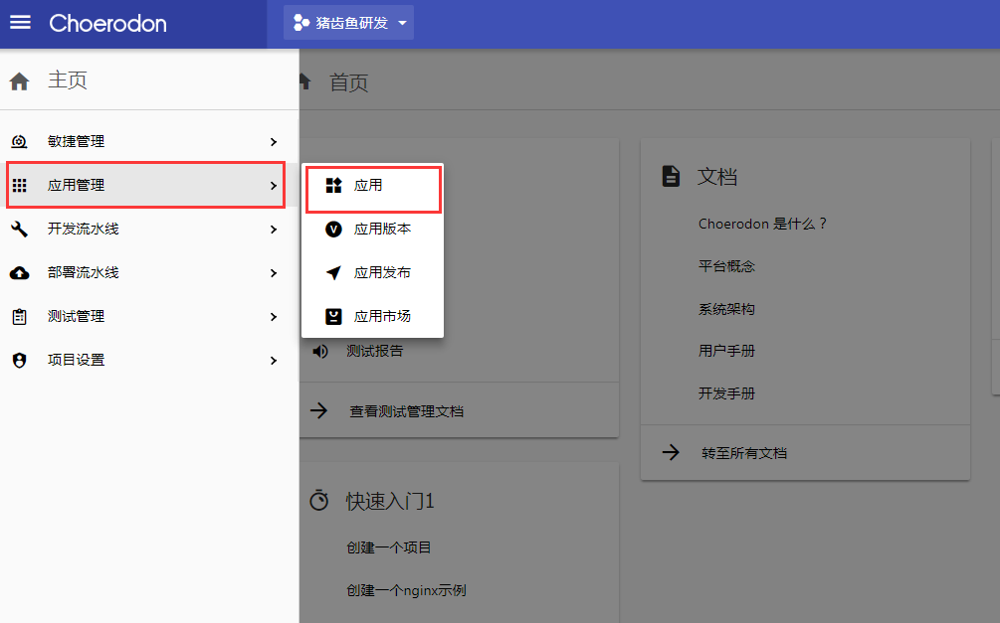

点击创建应用(确保已拥有该权限)

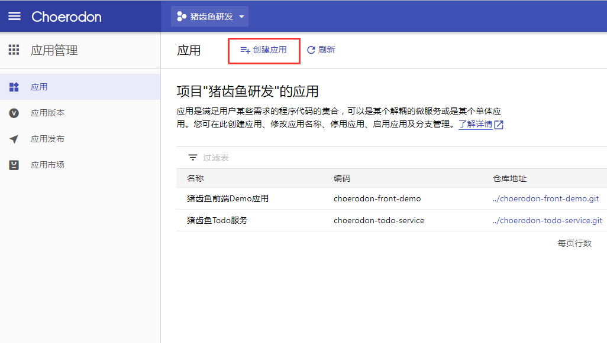

**2.** 输入编码和名称，编码用于描述应用名称，应用模板为空或者自行选择需要的模板

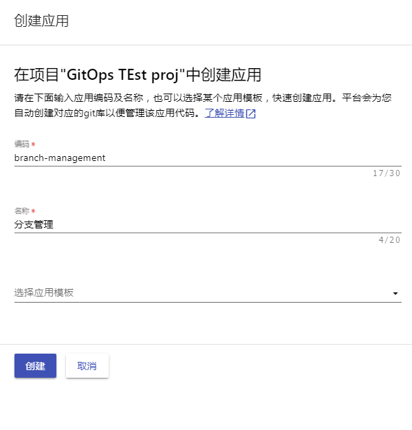

**3.** 创建成功后会出现应用的`gitlab`地址。

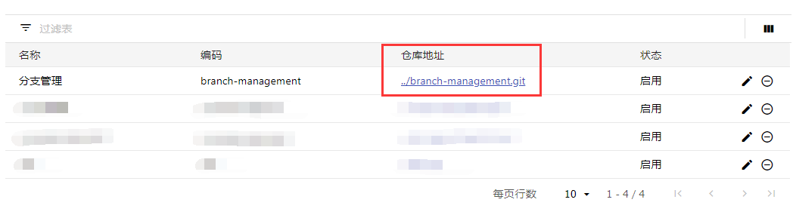

至此，我们的应用就创建完成，接下来就可以在这个应用上进行开发和分支管理了。

## 分支管理

**1.** 点击左侧菜单栏，选择开发流水线，点开分支，进入`Choerodon`分支页面
 
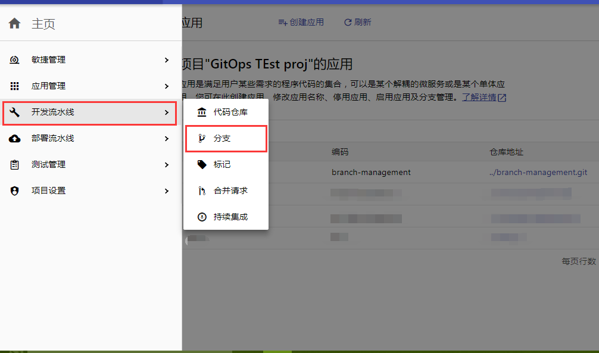

**2.** 选择我们刚才创建的`branch-management`应用
 
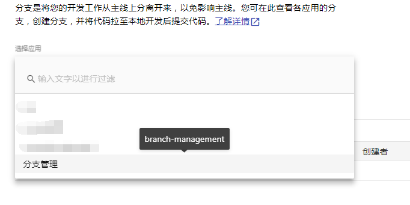

**3.** 点击上方的创建分支并填写分支信息，问题名称一栏需要在 **敏捷管理** -> **待办事项** 中创建相应任务才会显示
 
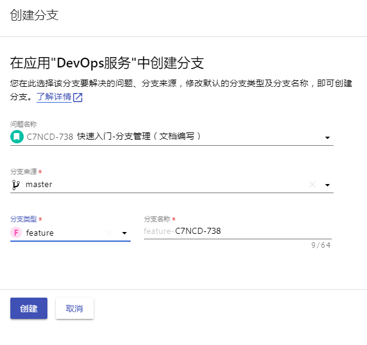
 
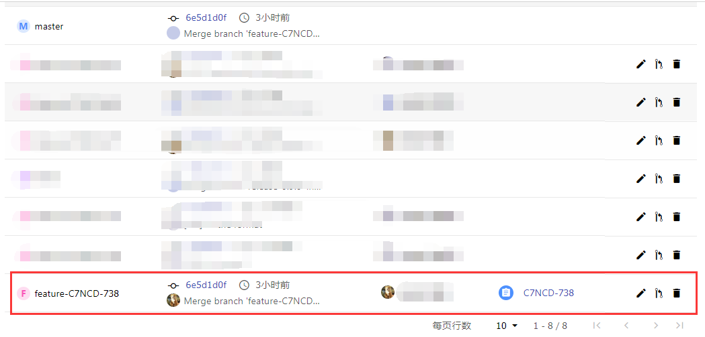
 
 至此，我们就完成了分支的创建，接下来就可以在分支上进行开发，然和合并到其他分支

## 创建合并请求

当我们在当前分支完成了开发后，我们需要将分支上的改动合并到其他分支用于对外发布正式版本，这时我们可以在`choerodon`平台上直接发起一个`merge`请求

**1.** 在分支页面找到我们需要合并的分支，点击创建合并请求
 
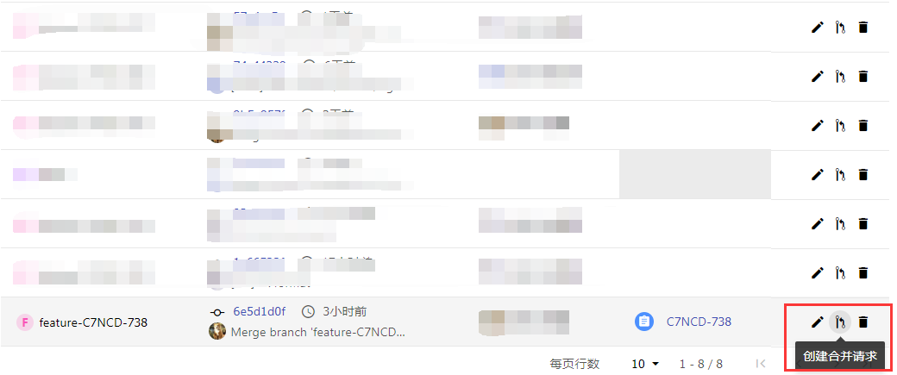
 
**2.** 选择我们需要合并到哪个分支，默认是`master`分支，点击`Compare branches and continue`按钮进行合并

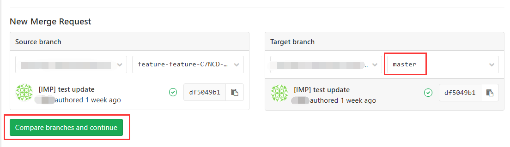

**3.** 按照相应的`Git`提交规范填写`merge`请求的`title`

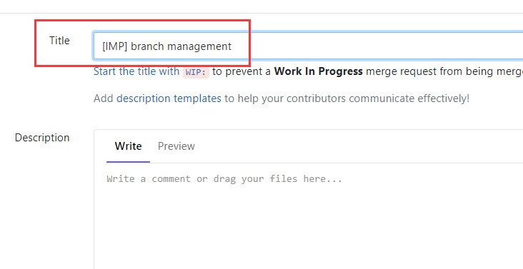 

 `Git`提交时，添加`Comment`请遵循以下要求：
 
 - [IMP] 提升改善正在开发或者已经实现的功能
 - [FIX] 修正BUG
 - [REF] 重构一个功能，对功能重写
 - [ADD] 添加实现新功能
 - [REM] 删除不需要的文件
 
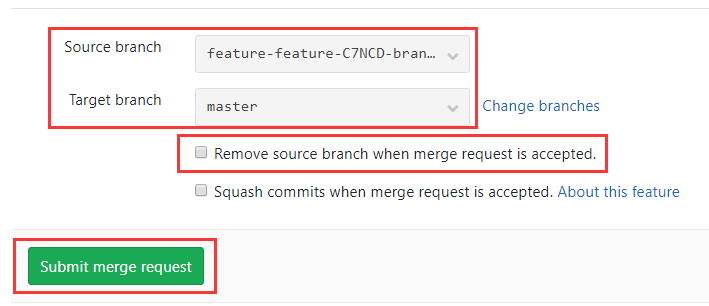 

填写完`title`后在页面底部还可以再次确认待合并的分支和目标分支，也可以选择是否在合并完成后删除源分支，最后点击`Submit merge request`按钮提交分支合并请求