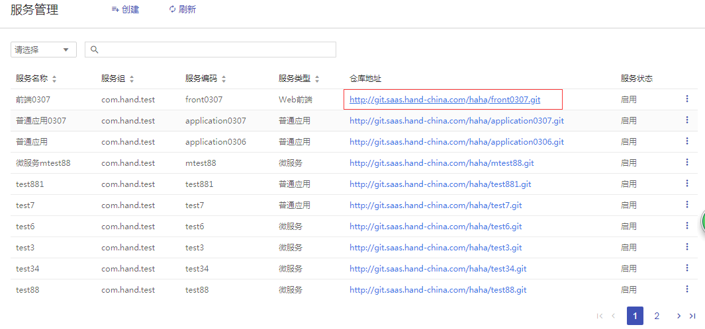
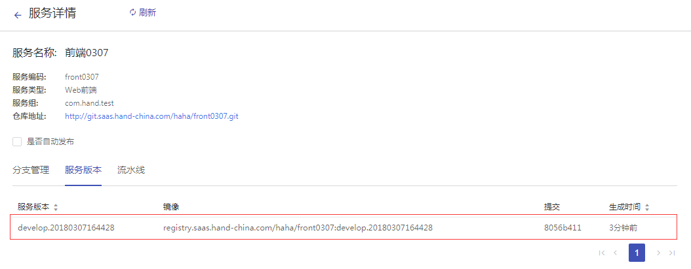
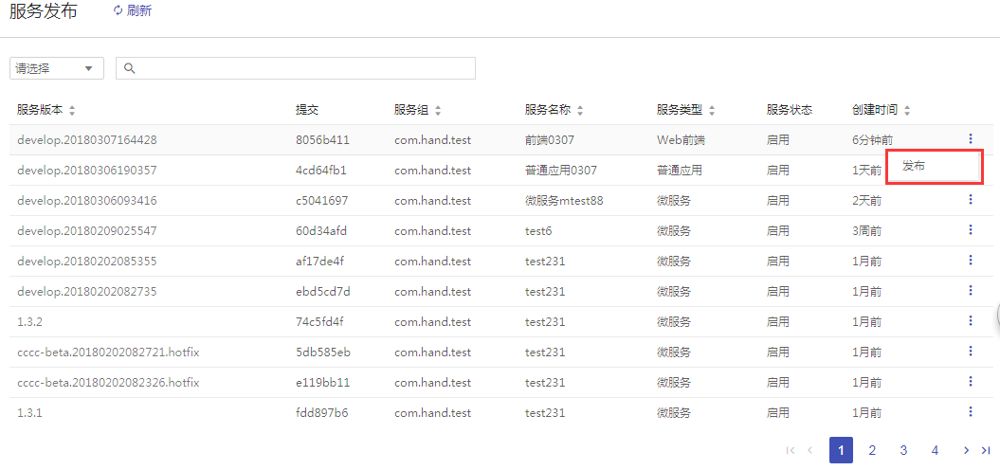
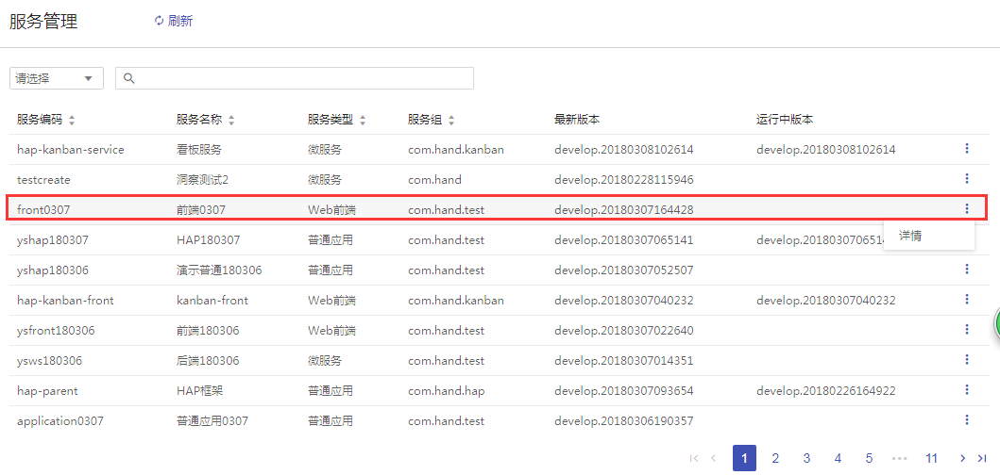

+++
title = "开发一个微服务前端"
description = ""
weight = 1
+++

# 快速入门

## 1 新建服务

- **菜单层次**：项目层
- **菜单路径**：开发管理 > 服务

1. 点击`创建`按钮。

    

1. 输入 “服务编码” 、 “服务名称” 、以及 “服务组” ，并选择相应服务类型，点击 `创建` 按钮。

    - 服务编码只能包含字母、数字、_、.、破折号和空格并且不能包含大写字母

    - 服务组输入不能包含中文或大写字母,不能以'.'开头或结尾

    

1. 新建服务 “front0307” 已在服务管理列表中。

    

1. gitlab已自动创建好对应服务类型的代码库 “front0307” 。点击 `仓库地址` ，可以查看该服务在gitlab的代码仓库。

    

    注：使用模板代码演示

## 2 生成服务版本
- **菜单层次**：项目层
- **菜单路径**：开发管理 > 服务 > 详情

 > 代码提交的历史记录，每提交一次修改后的代码，对应生成一个新的版本。

1. 进入服务详情后， 查看服务CI pipeline的完成情况，只有CI各个阶段跑成功了才会生成一条服务版本信息。

    

1. 查看服务版本信息。

    

## 3 服务发布

- **菜单层次**：项目层
- **菜单路径**：开发管理 > 发布

> 面向发布管理员，提供服务发布至不同环境的功能，向目标环境传输部署文件，同时附带服务版本信息以便追踪。 

1. 点击 `发布` 。

    

1. 关键字搜索或直接从从下拉列表中选择部署文件发布的环境，已发布的环境不能重新发布。发布的环境需要先在组织层配置。

    

    注：[环境配置](https://github.com/choerodon/choerodon)

1. 该服务部署文件已成功发布在某个环境。

    

1. 设置服务 “自动发布”，下一次生成的服务版本会自动发布到已配置的环境。[自动发布配置](https://github.com/choerodon/choerodon)

## 4 新建资源

1. 定义部署时需要使用的资源。[资源配置](https://github.com/choerodon/choerodon)

## 5 域名管理

1. 目前**Web前端**及**普通应用**需配置域名，若不配置域名，不能进行外网访问该前端，只能查看系统提供的pod ip。[域名配置](https://github.com/choerodon/choerodon)

## 6 服务部署

- **菜单层次**：组织层
- **菜单路径**：部署管理 > 服务

>提供可视化、一键式部署服务，支持并行部署和流水线无缝集成，实现部署环境标准化和部署过程自动化。

1. 点击 `部署管理`  ，点击 `服务` ，查看服务列表。

    

1. 点击`详情`。

    

1. 查看该服务版本信息。

    

1. 在服务列表中找到要部署的服务，点击`详情`，例如"front0307"。

    

1. 选择发布的版本，点击`部署服务`。

    

1. 进行资源选择，点击`部署`。

    

     注：服务第一次部署需要自己手动填写资源，再次部署页面会显示上一次部署选择的资源。选择资源一定要谨慎，选择错误严重会导致数据库数据丢失。

1. 点击`详情`，可在运行中查看正在部署/运行的版本，以及对容器数量进行调整。

    

    > 注：可用容器数量、当前容器数量、期望容器数量都为1时，代表该服务已经部署好了。期望容器数量的加减实际是对kubernetes的pod数量的加减，例如期望容器数量为2，代表kubernetes启动了2个pod，其中一个挂了，还能保证程序正常使用，目前期望容器数量不可为0。

1. 点击`详情`，查看服务`部署阶段`，点击`部署`阶段，点击域名地址访问。

    

    > 注：如果没有配置域名，此处显示的是IP地址。

    

1. 用于保障系统稳定，验证某服务版本是否正常使用，验证正常后再转为正式部署。[灰度部署配置](https://github.com/choerodon/choerodon)

1. **部署管理员**可以设置“自动部署”，设置了自动部署，服务版本发布了不再需要手动部署。[自动部署配置](https://github.com/choerodon/choerodon)
