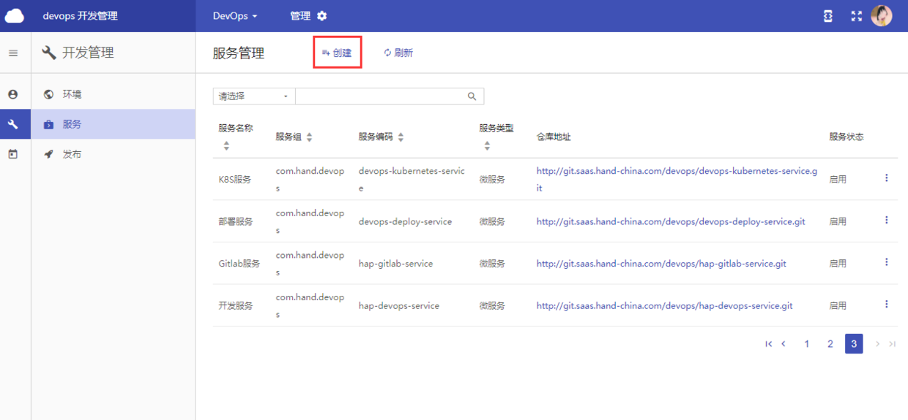
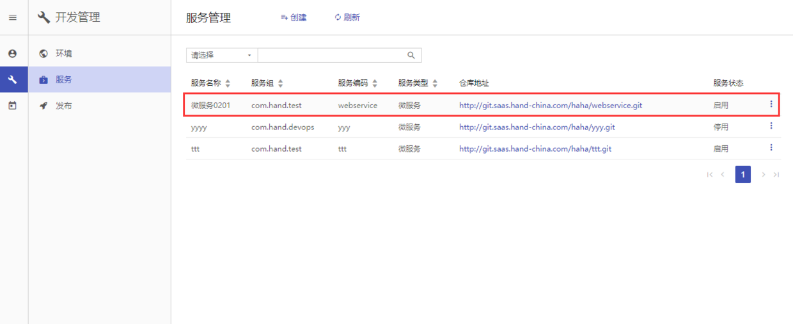
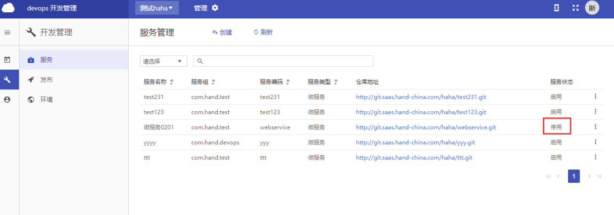
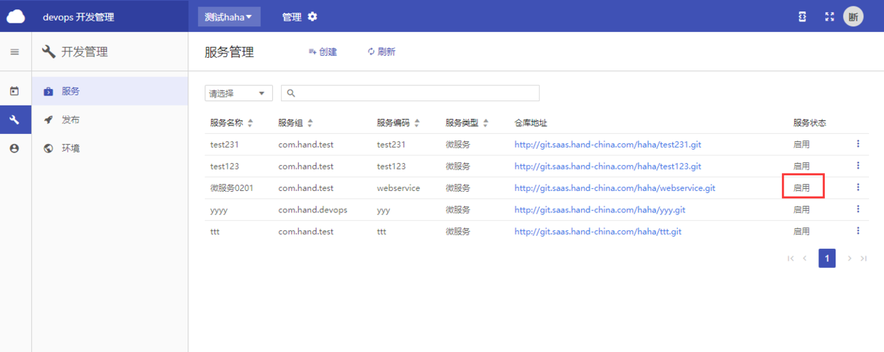
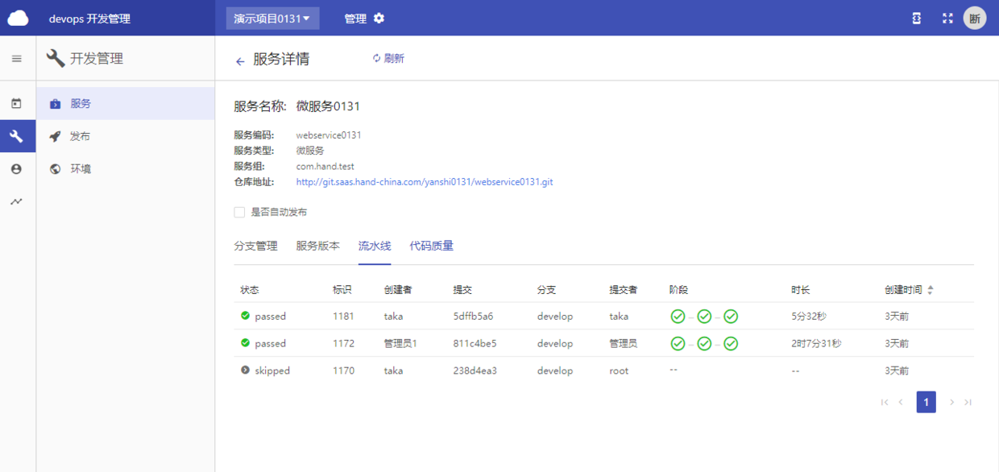
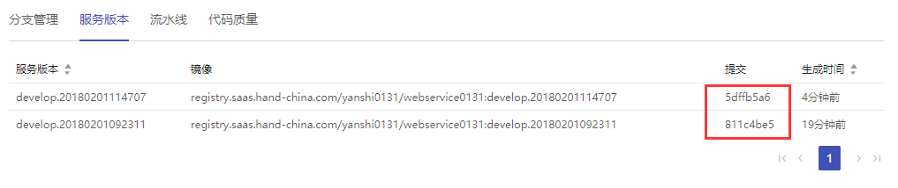

# 持续集成

## 服务创建

  - **菜单层次**：项目层
  - **菜单路径**：开发管理 > 服务

  > 每一个微服务都可以独立部署，每一个微服务仅关注于完成一件任务，每个任务代表一个小的业务模块，各微服务之间关系是松耦合的。 
  （备注：每创建一个服务，会自动在gitlab创建好对应服务类型的代码库。）

### 服务类型

  **微服务**：微服务后端，可以定义依赖的资源和服务，部署时需配置网关。

  **Web前端**：微服务前端，部署时需配置域名。

  **移动**：移动端应用开发使用，部署流程与其他类型不同。

  **普通应用**：非微服务架构的服务类型，如HAP、HBI等，一个系统一个服务。

  **Java库**：管理Java工具包。

### 服务组

  > 区分服务的开发来源，创建服务时需做标识。

  暂按如下设置。

  项目名称 | 项目编码 | 服务组
  --- | --- | ---
  HAPCloud | hapcloud | com.hand.hapcloud
  DevOps | devops | com.hand.devops
  智能洞察 | insight | com.hand.insight
  敏捷看板 | kanban | com.hand.kanban
  移动应用 | mobile | com.hand.mobile
  应用框架 | hap | com.hand.hap
  云维开发 | cloopm | com.hand.cloopm

### 新建服务

1.  点击 `创建` 按钮。

    

1.  输入 “服务编码” 、 “服务名称” 、以及 “服务组” ，并选择相应服务类型，点击 `创建` 按钮。

    

1.  新建服务 “微服务0201” 已在服务管理列表中。

    

1.  gitlab已自动创建好对应服务类型的代码库 “webservice” 。点击 `仓库地址` ，可以查看该服务在gitlab的代码仓库。

    

    

### 服务停用

点击 `停用`，如： “微服务0201” 已停用，服务详情不可查看。 

  

  

### 服务启用

点击 `启用` ，如： “微服务0201” 已启用，可对该服务进行相关操作。

  

  

## 分支管理

  - **菜单层次：** 项目层  
  - **菜单路径：** 开发管理 > 服务详情

  > `git flow` 工作流模式，自动创建 `Git Flow` 模式所特有的流水线分支。  
  在持续交付过程中对 `feature`、`release`、`hotfix` 等分支进行管理。

### 分支类型

1.  **Feature：**
  适用于日常开发、bug 修复，基于开发分支生成，完成时合并至开发分支。
1.  **Release：**
  适用于产品发布、产品迭代，基于开发分支生成，完成时合并至主分支和开发分支，并打上标签。
1.  **Hotfix：**
  适用于产品发布后修复bug，基于主分支生成，完成时先合并至主分支和开发分支，并打上标签。

### 默认分支

**Develop：** 日常开发分支。  
**Master：** 版本发布分支。

### 使用流程


### 新建分支

#### 新建 Feature 分支

1. 点击`创建Feature`按钮。

    

1. 输入 `Issue` 编码。

    

1. 点击`保存`按钮。

    

#### 新建 Release/Hotfix 分支

1. 点击 `创建Release` 按钮（或 `创建Hotfix` 按钮）创建对应分支。

    

1. 输入分支名称。

    `Release` 分支创建时会自动生成下一个版本号，也可以手动输入需要的版本号。（版本号由三个数字组成，中间以小数点间隔。如：`1.1.0`。
    `Release` 版本号默认为末位清零，中间一位进一）。

    `Hotfix` 分支建议填写 `Issue` 编号作为分支名，也可以手动输入需要的版本号。填写 `Issue` 编号在结束分支时会提示以最新 `release` 小版本加一作为版本号。

    

1. 点击`确定`按钮。

    

    **注：** 无提交时点击结束分支，将不创建合并请求，直接删除。新建分支及结束分支只能在平台界面进行操作，请勿随意在gitlab界面创建合并请求和删除分支。

### 分支管理步骤

1. 克隆代码到本地

    ```bash
    # 在存放代码的文件夹下执行以下命令
    git clone http://git.saas.hand-china.com/devops/hap-devops-service.git
    # 拉取远程仓库成功后进入仓库
    cd hap-devops-service
    ```

1. 拉取最新代码和新建的分支

    ```bash
    git pull
    ```
1. 切换到分支

    ```bash
    # 切换到新建分支，以 feature-2 为例
    git checkout feature-2
    ```
1. 开发

    根据分支对应的 `Issue` 需求修改代码。  
    完成后详细检查本地代码改动。

1. 提交代码

    ```bash
    # 将本地代码变动提交到暂存区
    git add .
    # 提交代码并且为本次提交添加 commit 信息
    # 注：[FIX]修改bug  [ADD]新增  [IMP]完善  [DEL]删除
    $ git commit –m “[ADD]readme: 新增代码示例”
    # 将本地提交推送至远程仓库对应分支
    $ git push origin feature-2:feature-2
    ```
1. 界面操作结束分支

### 解决分支冲突

#### Feature 分支冲突

常见两种解决冲突的方式如下

- 本地修改代码解决：

    ```bash
    # 确保当前正在 Feature 分支上，以 feature-2 为例
    git checkout feature-2
    # 拉取最新远程仓库 develop 分支代码
    git fetch origin develop:develop
    # 将 Feature 分支重新设立起点于最新的 develop 代码
    git rebase develop
    ```
    执行完 `rebase` 操作后，会产生对应的冲突，解决冲突后执行如下代码。
    ```bash
    git add .
    git rebase --continue
    ```
    根据本次 `Feature` 分支上提交次数的不同，解决冲突可能会重复多次，只需要重复执行上述解决冲突操作。  
    完成后强制提交至远程仓库。
    ```bash
    git push -f origin feature-2:feature-2
    ```

- 界面解决冲突（不建议）：

    在 `GitLab` 对应的合并请求界面点击 `Solve conficts` 按钮。

#### Release&Hotfix 分支冲突

当分支对于 `develop` 和 `master` 分支中任意一个或以上存在冲突时，会提示当前存在冲突，以及建议做法。

若此时继续点击`确定`按钮，并且没有**解决冲突**，那么会提示分支冲突，无法继续操作。解决冲突具体步骤可查看界面提示，说明如下：

  1. 只有对应 `develop` 的合并请求存在冲突，按界面提示解决冲突会导致分支对应 `develop` 分支的合并请求被合并。此时再进行**结束分支**操作，会处理分支对 `master` 的合并请求，然后生成对应版本号的 `Tag` 并删除分支。

  1. 只有对应 `master` 的合并请求存在冲突，按界面提示解决冲突会导致分支对应 `master` 分支的合并请求被合并。此时再进行**结束分支**操作，会处理分支对 `develop` 的合并请求，然后生成对应版本号的 `Tag` 并删除分支。

  1. 若分支对应 `develop` 和 `master` 分支的合并请求都存在冲突，按界面提示解决冲突会导致分支对应 `develop` 和 `master` 分支的合并请求依次都被合并。此时再进行**结束分支**操作，会生成对应版本号的 `Tag` 并删除分支。


## 服务版本

- **菜单层次**：项目层
- **菜单路径**：开发管理 > 服务详情

代码提交的历史记录，每提交一次修改后的代码，对应生成一个新的版本。

### 查看服务版本信息

1. 进入服务详情后，点击 `服务版本` 页签。

    

1. 查看服务版本信息。

    

### 查看流水线信息

1. 进入服务详情后，点击 `流水线` 页签。

    

1. 查看服务CI pipeline的完成情况。

    

    注：版本命名方式：合并至develop：develop. + 年月日时分秒。

    Tag生成：版本号（三位号码，如：1.1.0。release修改前两位，hotfix修改第三位）。
    提交：每次提交代码的操作，自动生成Commit ID，由于字数多，平时多取前八位。

    

### 查看代码质量情况

  可在服务详情-代码质量查看。面向团队成员，反馈代码质量信息，按照相应的代码规范及标准在线进行代码静态检查、代码安全检查、质量评分、代码缺陷改进趋势分析，辅助管控代码质量。

  服务详情-代码质量：只看该服务下经单元测试后的代码质量情况。

  注：可从开发监控了解项目整体及DevOps全链路各个环节进展情况。

## 服务发布

### 服务发布

  - **菜单层次**：项目层
  - **菜单路径**：开发管理 > 发布

  > 面向发布管理员，提供服务发布至不同环境的功能，向目标环境传输部署文件，同时附带服务版本信息以便追踪。 

1. 点击 `发布` 。

    

1. 关键字搜索或直接从从下拉列表中选择部署文件发布的环境。

    

1. 点击 `保存` 。

    

1. 该服务部署文件已成功发布在开发或正式环境。

    

### 自动发布

  - **菜单层次**：项目层
  - **菜单路径**：开发管理 > 服务 

  1. **项目所有者**可以设置服务 “自动发布” 。

      

  2. 可以选择一个或多个环境。

      

  3. 点击 `保存` ，版本生成会自动发布部署文件至所选环境。

      

      注：自动发布仅针对于开发环境，正式环境需手动发布。
