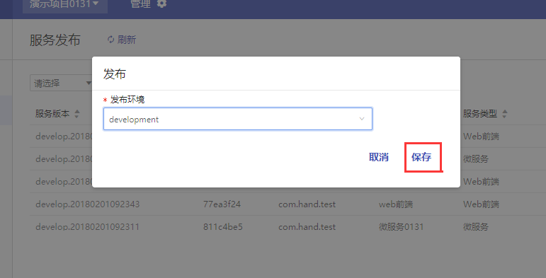

# 服务发布

## 服务发布

  - **菜单层次**：项目层
  - **菜单路径**：开发管理 > 发布

  > 面向发布管理员，提供服务发布至不同环境的功能，向目标环境传输部署文件，同时附带服务版本信息以便追踪。 

1. 点击 `发布` 。

    

1. 关键字搜索或直接从从下拉列表中选择部署文件发布的环境。

    

1. 点击 `保存` 。

    

1. 该服务部署文件已成功发布在开发或正式环境。

    

## 自动发布

  - **菜单层次**：项目层
  - **菜单路径**：开发管理 > 服务 

  1. **项目所有者**可以设置服务 “自动发布” 。

      

  2. 可以选择一个或多个环境。

      

  3. 点击 `保存` ，版本生成会自动发布部署文件至所选环境。

      

      注：自动发布仅针对于开发环境，正式环境需手动发布。
